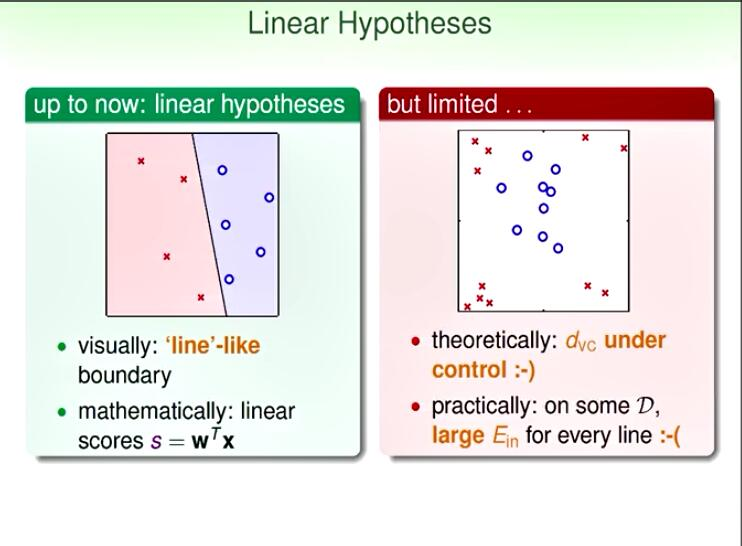

线性不可分

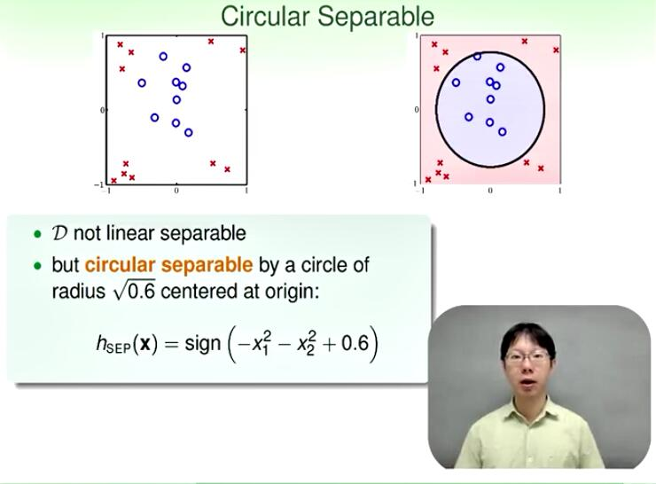

但确实圆边界可分的

如何做到用圆来作分类呢：

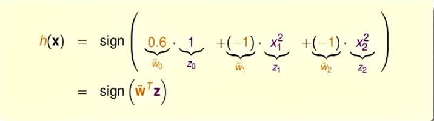

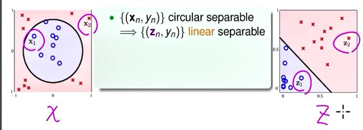

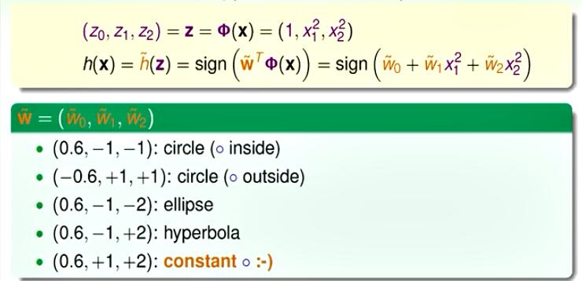

在$Z$空间<->在X空间的特殊的二次曲线划分

进行一般化：
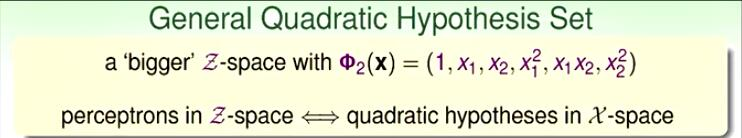

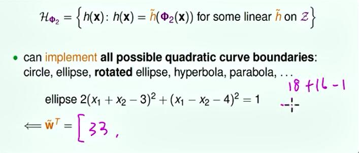

进行优化：

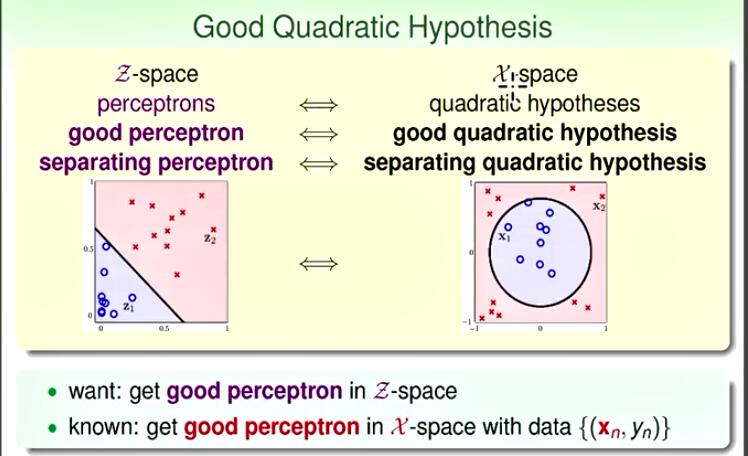

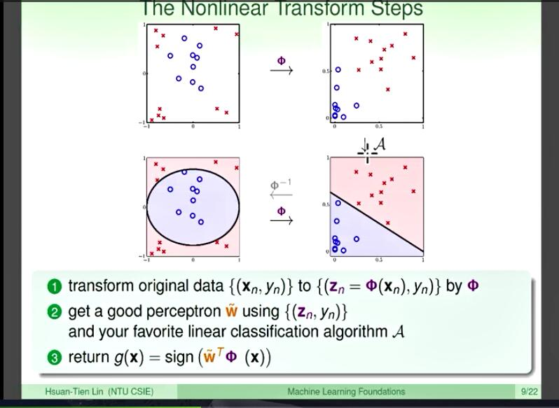

好，那我們來看看，所以我們現在已經建立的關係是這樣。 在Z空間裡面，所有的這些直線就對應到X空間裡面， 所有的二次曲線，如果我用我剛才的這個6個維度的二次變換的話。 那你就用了什麼？如果今天我在Z空間裡面找到一個好的Perceptron，一條好的線。 那就會對應到X空間裡面一個好的二次曲線，什麼叫好的？我們剛才已經給大家舉 一個例子。說，如果今天可以分開來叫做好的話，Ein是最小的，叫做好的話。 我們只要在Z空間裡面，找到一條可以分開來的直線，我們就在X空間裡面找到一個可以-
分開來的 二次曲線。在剛才的例子裡面，這個二次曲線恰好是一個正圓，好，所以我們現在要做的事情-
是這樣。 我們想要在Z空間裡面，找出好的線。 那就這樣，那怎麼做呢？我們現在只會做在X空間里找出好的
線啊，我是用X跟Y這樣的資料，來找出好的線。 那我要怎麼在Z空間里找出好的線，大家可能已經猜想到了，我們做的事情就是使用Z空間-
的資料。 好，也就是說，我用我剛才那個Φ2，把X空間的東西通通變到Z空間裡面，在Z空間上面去找 一條好的直線，用我們學過的任何有趣的Binary
Classification的方法，去找一條好的直線。 什麼意思呢？好，所以我們做的事情是這樣子，這是一個很簡單的演算法。我們做的事情就是 我們先把原來X空間的的資料，透過 我們這個轉換，把它轉成Z空間的資料。 好，所以這邊這個資料轉換，大家看到我在下邊沒有涂顏色，我只是說，哎，我原來手上拿了-
資料，我就做一個這樣的轉換動作。 轉換之後，我在Z空間裡面，想辦法去找出一條好的 線，用這個A，OK，A就是任何你所喜歡的Binary
Classification的演算法。 你用它去在Z空間裡面找出一條好的線。 好，找出一條好的線，就幫助你在Z空間裡面做分類的動作。 那這個Z空間裡面的分類動作，會對應到什麼呢？ 如果我們想象，我們是，做的操作的是，把它做一個 反對應，反對應回到X空間的話，那麼我就會得到，跟我在Z空間裡面這條線，相對應 的那個曲線圖，例如說，我的，剛好這條直線
若對應到一個橢圓的話，那我畫在原來的X空間裡面，就會是一個橢圓。 注意到我這邊用灰色的，而且我說，我們是想象做這個反運算的動作，因為這個反運算其實也不 一定真的存在。OK，也就是說，今天我沒有說X到Z的關係是真的一對一過去，等等的話。 所以反運算是不一定存在的。好，那但是我們是想象這個動作，那我們實際上做動作是什麼？ 我們實際上做的動作，是把任何一個，在X空間裡面的這個點，例如說我現在的點在這邊， 把它對應到Z空間里面 的某個地方，對應到這個某個地方以後，我看看這個點是紅色還是藍色。 然後我在X空間裡面對相對的顏色。也就是說在
操作上，我實際上做的事情，是，不是往左邊的箭頭， 而是往右邊的箭頭。好，這個往右邊的箭頭告訴我，我在這裡X後面每一個點，我都可以對應-
到Z空間裡面。 然後我等Z空間告訴我說，它是紅色還是藍色。我那邊有那條線，告訴我是紅色還是藍色。 然後我在X空間裡面，點上相對應的顏色，然後我做出這個相對應的圖。 好，所以，實況上，我們做的還是一個從X空間到Z空間的動作，只是 抽象上，我們想象，我們其實是從Z空間走回X空間 來，然後畫一畫說，相對應的這個邊界到底是長什麼樣子。 好，所以這是我們的這個流程，非常的簡單，我們裡面有兩件 你可以選擇的事情。一件事情就是你要怎麼做轉換，你要轉換到什麼樣的Z空間去？ 而另外一件事情，則是你想要用什麼樣的這個Linear Model，你到底要用 Perceptron Learning
Algorithm，還是你要用Logistic Regression，還是你要用Linear
Regression，還是你要任何事情。 那雖然我們這邊用這個二元分類Binary
Classification，來跟大家做講解，大家可以想象，同樣的 方式也可以延伸到做 Regression，做Logistic
Regression，甚至是做[iii]上面。 因為你最核心的事情，只是換一個空間去做Linear和Learning，我們現在已經-
很會做Linear和Learning了。 那現在加上的事情，只有換一個空間去做Training的時候，換一個空間去做，去找出-
一條線。 然後Testing的時候，換一個空間過去，找，說，到底預測的結果是怎麼樣？ 好，那我這邊，這個下面跟大家說，哎呀，這叫做潘多拉的盒子打開了。 什麼意思？我們現在可以做很多很多很多不同的事情。你原來學過PLA，學過 Pocket，學過了Linear Regression，學過Logistic
Regression，現在呢？好，全部都可以二次化， 好，很容易，你只要配一個二次轉換，你就二次化。所以你就有 這個二次的PLA，你用二次的回歸分析，你用二次的Logistic
Regression。 你說那三次化可不可以？哎，當然也可以，所以你就有三次的PLA，三次的回歸分析，三次-
的Logistic Regression。 好，一路下去，哇，你說，真的多會做好多事情啊。 是啊，沒有錯，所以知道了這個Feature Transform的奧秘之後，看起來你是 可以多做很多事情，有了這個Φ，你的這個運用，你的演算法的靈活度，就增加了。 那必須跟大家講，這個事情呢，對我們來說，其實不是新的。 我們早就偷偷跟大家講過Feature Transform的重要，
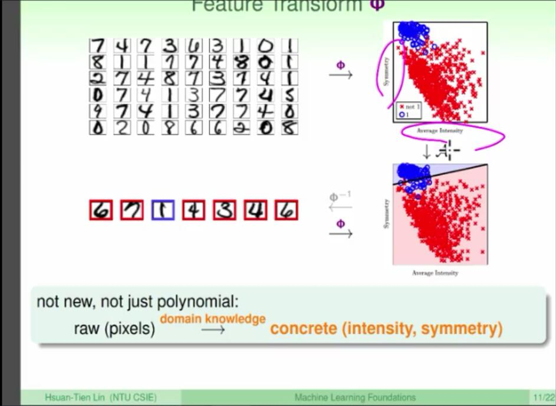
什麼時候講的，我們說我們之前在討論 說，我們在做機器學習的時候，可以用哪些Feature？
想一下，我們什麼時候講過這個？想想想想想， 哦，第三講的時候，我們跟大家講過這個。我們說呢，Feature呢，有幾種，其中一種-
是Concrete， 也就是說，它帶有很深厚的物理意義的。一種是Row，也就是說，哎，它是原始我們搜集進-
來的信號的 資料，我們之前講到說什麼？哎，你搜集出來的信號資料，你可能把它做一些 整理的動作變成Concrete，例如說，我們之前說，在做數字分類的時候。 你收進來的資料可能是一個一個點的值，你把它整理一下，變成你真正想要用來分類的，-
說，今天 有Symmetry和它的對稱性，今天有Intensity，好，這個這個，到底它占了-
多少黑色的格子。 好，所以原來是一個256維的向量，也就是16乘16的灰階圖，現在你變成一個二維的向-
量，你在二維的向量 上面做分類的動作，我這邊呢，是把1的數字，
跟其他的數字分開，做一個分類的動作，有點像我們之前講過的 一對多的這個conversation的方式，對這個1在做。 好，所以我們以前就做過這個事情。然後我們真正在測試的時候怎麼樣？你寫一個新的字，
我們一樣產生出這兩個Feature ，然後決定它是紅色的還是藍色的，它是圈圈還是叉叉。 所以我們以前就做過這個事情，只是我們那時候做的時候，我們用來
做的方式是什麼？我們是用來把`Row Feature`，這些原始的資料，透過
我們對這個問題的了解，比如我們對這個問題的了解，可能告訴我們對稱性 很重要，或者它可能告訴我們說，哎，這個它占了多少的黑格子很重要。 然後，經過這個轉換以後，變成這個具體，比較容易吸收的這個Feature。 所以以前我們就做過這件事，只是我們現在更把大家提醒出來說，哎，這樣可以幫助 我們在原始，在這個例子裡面，原始就是你的Pixel，在你的Pixel空間裡面做非線-
性的事情。 好，所以，這個我常跟大家講說，這個呢，是Machine Learning裡面的 The Force，OK，這個，如果有看這個《星際大戰》的朋友，應該知道說，The
Force是這個人力的意思，也就是說宇宙中， 最，最大的那個力量，好，那這個`特征轉換`這件事情呢，是
實際上對應到的是很強很強的力量，你可以用它來做很多很多的事情。 那大家想，啊，好棒啊，那看起來我現在多學會了很多事情。 我問大家啦，這個事情聽起來是很好， 但是我們做這個`Feature Transform`，`做Φ這件事情`，到底`有沒有什麼代價呢`？ 好，那等一下我們要回答這個 問題，但是要激起大家對這個問題的興趣，我們先來算一算， 如果我今天要做一個二次的轉換，而且呢，我現在不再是對原來我的二維空間里的點， 做二次的轉換，我想象我原來的點在d個維度，例如說你的d可能是10個維度，可能是10-
0個維度。 然後我們做二次的轉換，那我要問大家，請大家 算一算說，轉換過去以後，我到底需要幾項？ 也就是說，我的Z到底在幾個維度的空間裡面？ 好，那大家算一算之後，我會希望大家可能可以算出來說，我們 有，我們需要多少個二次項？我們需要二次項是，我從第一個裡面取兩個不一樣的。 還有呢？我從第一個裡面取兩個一樣的，所以d取2加上d這麼多個二次項。 我有多少個一次向？我有d個一次向，我有多少個常數項，一個常數項，好，這些加起來， 就是我們參考的2號答案，說，哎，有這麼多個項。

你有這麼多個項的意思是什麼呢，所以如果我 今天要做很general一般的所謂的`Q次 的多項式轉換`，剛才是二次現在我們變成Q次，Q次的話
我就要列出來什麼，好，就我列出來的是這是到`一次的部分` 然後呢還要有`二次的部分`，所有的`二次式`
好，所有的三次式一路列出來，一路列`到所有的Q次式`， 這是所謂Q次的多項式轉換，我們需要的所有的式子，那怎麼樣呢 這裡面有`多少個dimension呢`，好，我們一般要算它這個Z有多長的時候 我們用`1 加上`$\overline d$`來做代表`，這個1特別把它獨立出來是因為，也 就有點像，我們之前在線性的模型裡面，那個d加1一樣，那個1代表的是常數的那個 然後其他非常數的有幾個dimension，我們把它叫做 $\overline d$，ok一樣加一個小蚯蚓代表我們是在Z空間裡面發生的事情， 這麼多個dimension到底有多少你呢，大家可以想象說
我需要什麼，我需要算的就是有多少種不同的方法 來組成Q，這個次方是Q或者小於等於Q那麼多的項 那這對應到，大家可能高中的時候學過，就是所謂的重複組合 我有d種不同的東西，我要取Q個出來，或者取小於等於Q個出來 請問有多少種取法，如果我允許這d種不同的東西我可以重複取的話，有多少種不同的取法 那大家可以去翻一翻高中的排列組合的書，那它會告訴你說 你的取法總共就是Q加d取Q這麼多 Okay，用二項式，Q加d取Q這二項式這麼多，或者Q加d取d這麼多 好，列出這樣的式子，是要告訴大家說如果我們把d看成一個常數，因為這是你資料裡面已經有 我們已經給定的話，那麼你使用什麼Q的這個 成長是什麼呢，大概就是這個Q的d次方 那也就是說，你就是付出Q的d次方，這麼多項 Q的d次方這麼多項代表什麼，代表今天就要花這麼多的力氣 在計算，計算什麼，你把X這個 送到Z要計算，就是說X是二維的，好Z那邊是六維的 好所以你要花一個六的力氣去做計算，你今天要算W
好算W不管你今天是pocket也好，linear regression也好，logistic regression也好
好，你要算W至少至少你要花$\overline d$加1的力氣 去做更新吧，對不對POA，每次更新你就要花$\overline d$加1 的力氣 那這個linear regression 搞不好更慘，因為那個矩陣，那個矩陣是 $\overline d$加1乘上$\overline d$加1，然後你要做反矩陣的動作 好所以，計算上，你要花增加的力氣， 還有什麼要花增加的力氣，儲存上也要花增加的力氣，你只要把那個W
那個$\overline W$存起來，然後做對未來的預測 這個是要花力氣的，計算上儲存上，你都要花額外的力氣，在你的演算法裡面
所以使用這個變換`並不是for free` 並不是這個沒有代價的，你的代價 之一就是你在計算上跟儲存上，要花額外的力氣 那如果你的Q很大的話，這一件事情是很困難的，因為你要你要儲存一個很長的向量，一萬維-
，兩萬維的向量 那可能是，你要更新這個向量，或者從最佳化的角度來說，你在那個 空間裡面要找到好的W~當做你的解，這些可能都是很困難的
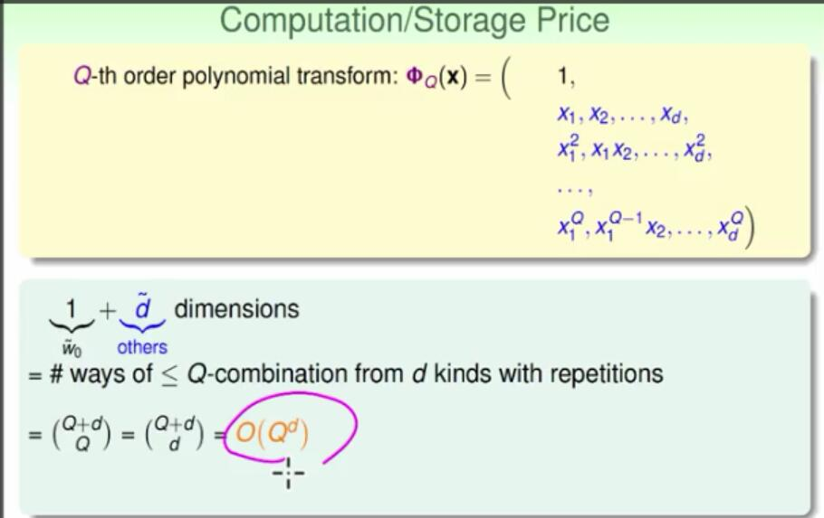
 好，那還有另外一個代價是這樣 我們剛才講了它有多少項，它有$\overline d$加1的那麼多項，這個大概是Q的d次方那麼多項 這同時也代表什麼，代表我就要有這麼多個 W，那我們之前說到這麼多的W大體上就代表這麼多 個自由度，也就是我的VCdimension大概就是$\overline d$加 1這麼多 不過啊，這下慘了，你原來linear model過得很好，只有d加1 那樣的自由度
你現在有$\overline d$加1那麼大的自由度，然後這個自由度，隨著這個Q是一路很快的長上去 這樣問題就出來啦，那怎麼辦呢 by the way實際上我們可以證明的事情是，這個我們這個新增加的 自由度，最多最多是$\overline d$加1，我們沒有說，這個下限是，我上限是$\overline d$加1 為什麼，因為任何一個在Z空間裡面 的d加2個點，我們知道在Z空間裡面$\overline d$ 加2個點是沒有任何一條直線沒有任何一個perceptron可以shatter的 對不對，這是之前已經證過的事情，Z空間裡面d加2個點，無論如何都不能被shatter 那這代表什麼，這代表我們回到X空間裡面 X空間裡面的d加2個點，也不能夠被 任何我們要用的Q次的曲線來shatter，如果那邊可以，我就找出一組係數，在Z空間-
裡面也可以shatter 那看起來是不對的，所以Z空間裡面不能shatter代表
我回到X空間，我也不能用Q次的曲線來做shatter 我這樣就對我們的VC
dimension產生了一個限制，那在這邊呢，另外一個方向的部分 比較難證明，我們這邊不特別跟大家提，我們希望大家只記得是上限的部分，我們可能最多最多
要付出$\overline d$加2那樣的代價 好，這是所謂的model
complexity的代價，也就是說我的Q變大的時候，我的VC dimension也變大
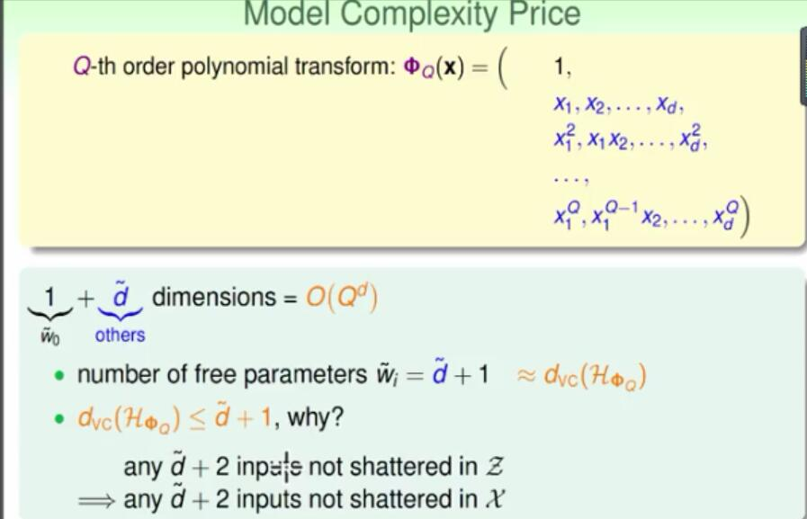

 那這一件事情有什麼壞處呢，我先問問 大家啦，我這邊列了兩張圖，同一個資料，`兩種不同的分類方式` `左邊`那張圖說我用一條線來做分類，`右邊那張圖` 說我`用一個四次曲線來做分類 右邊那張圖Ein是0`，圈圈跟叉叉都分得很開，左邊那一張圖用一條線然後但是`有幾個 圈圈有幾個叉叉，看起來是被擺在錯誤`的那邊請問大家你要選哪一個 好，大部分的人看看之後可能會說，我們`選左邊那個吧，左邊那個 視覺上來說，好像是比較符合我們對這個資料的特性的認知` 右邊那個雖然Ein是0，但是可能太過頭了 對不對，可能這個有一些看起來顯然不太合群的點，居然也被我們分隊，這樣的使用方式`太過頭了`
也就是說這是什麼呢，在回到我們之前講過的 說今天我們使用不同的hypothesis set
的時候 我們會冒出不同的問題來，它們對這個 我們在learning裡面，兩個核心的問題，`Ein跟Eout接不接近`
`還有Ein夠不夠小`，兩個問題的這個trade-off是不一樣的 我今天如果這個$\overline d$ 或者哪個是我用的Q這個變換是大的時候 大的時候怎麼樣，`大的時候我就可以讓Ein還蠻小的`，我開心因為它還蠻小的 但是另外一部分來說，我`Ein跟Eout可能就會隔很遠`，所以這是我沒有辦法滿足的- 好的地方 那另外呢，如果我今天$\overline d$是`小的時候` 那我就可以`讓Ein跟Eout靠的很近`，這裡很開心，`可是另外一方面來說，Ein可能-
就會很大`

 所以一樣，我們再三的強調這是在machine learning裡面，最重要的一個trade-off 所以大家可能又會問啦，我們要怎麼選擇 適當的變換，我們要怎麼選擇到底我要用哪個φ呢 好，所以這是一個問題啦，那大家想不然這樣好了，我們剛才是怎麼選擇 要用φ1，φ1也就是我完全不做任何的轉換，或者我用所謂的一次轉換 然後還是我要選φ4，我說我是用眼睛來決定，那就是說，我實務上我可不可以就用眼睛來決定我要用什麼轉換就好了 好，我先問大家，如果我今天給你的資料是在一個十度空間裡面 你真的有辦法用眼睛來決定嗎
好，至少我不行，我不知道大家可不可以，如果這個你幾何想像能力很厲害搞不好可以 但是我真的沒辦法，高維度的空間，我們大部分的時候用的資料都是高維度的資料
這個你要用視覺來決定，這個不太容易 然後即便在低維度的空間裡面，我們要跟大家講的是你用眼睛決定可能會有 一些潛在的問題，什麼意思呢，好例如說我們現在低維度的空間，想象我們覺得要用二次的曲線 二次曲線，我們之前說需要，如果我今天要用最一般的二次曲線 的話，我需要六種不同的變換方式放在同一個Z裡面， 好，你說用的這個，你找到了一個hypothesis 你用眼睛看一看，發現這個hypothesis它不用這麼複雜，它不用六個維度 說那我們可不可以用三個維度就好 也就是說我剛才原來要用這個VC dimension等於6，也就是我要付出7 6的代價，現在呢，我付出VC dimension等於3的代價就好
3的代價就是，你眼睛看一看，你剛才已經做過6了，然後你眼睛看一看說不用了不用了，我- 只需要3就好了 我是不是付出3的代價就好了，你說，啊，是這樣嗎？ 那有一個更聰明的這個同學就說啦，哎，不然我們幹嘛要只付出3的代價？ 我們付出2的代價好了。什麼意思？哎，反正我今天x1跟x2我如果要正圓的話 我只要算它們這個跟原點的距離的平方就好了。我們2的代價就好了。我第一維度的變換-
是常數。 第二維度的變換我不用一定死守著這個，嗯，一般的polynomial。 我說我有一個特別的polynomial，x1加x2的平方好不好？
哦，乍看之下你好像從原來要－6的 model complication代價降到2個model
complication代價。 說這樣可以嗎？大家心裡已經開始有個問號了。 那我要說，哎，好啦，我是老師，我來做最聰明的事情好了。 最聰明的事情就是，我直接使用一個z是長這個樣子。 我的z是把這個0.6，好然後跟這個x1的平方, x2的平方做相減，取了sign 當作我的變換。對吧？我的變換不一定要是多項式，我的變換也不一定要是平方函數啊。 我的變換可以加上sign，可以加上什麼？可以加上任何我覺得有道理的事情啊。 乾脆我做這樣的變換，我變到什麼？我的z變到1維空間。連那個加上的常數項都不用了。 哎，這樣我是不是只要付出VC dimension是1的代價？ 聽起來太棒了吧！可是 你想一想，在我們剛才這個過程裡面，實際上是你做了什麼？ 你聰明的小腦袋經過了一些運算，實際上經過了你聰明的小腦袋的學習過程 把適合的特徵變換用出來了，用在這一個資料上面。 這一個，這跟我們原來VC的推論裡面說，哎，我今天從某個distribution,
然後可能會產生很多種資料 然後我們要去算說，哎，到底我們什麼時候，有多少時候會運氣
好，產生說可以讓我們做學習的資料，什麼時候會運氣不好 產程說，哎，有時候會踩到地雷的資料。對不對？以前我們VC的分析是這樣。現在，你用你-
的小腦袋 做出了一個適合這個資料的 這個，嗯，transform的方式。這代表什麼？ 你要付出的代價已經在你的小腦袋裡了。這已經不是
你說我幫機器省了力氣，對呀，這是你的human learning. 不是machine learning。也就是說你看過，你看過你的腦袋已經處理了。 你的腦袋做了human learning之後，再交給機器的東西，已經受到 你的腦袋裡的主觀的選擇的影響。 我們之前說，機器學習的那個這些代價從哪裡來？這些model complication 代價來自於我們要讓我們的演算法可以好好地做選擇。 你現在說，我做轉化我不用讓我演算法做選擇，我做選擇就好。 你做選擇好啊。可是你的腦袋做選擇，付出的這個代價要被算在 裡面啊，不然的話，哎，機器就賺到，也就是說你會太高估你的機器學習可以做到的事情
實際上，都是你聰明的腦袋做到的事情。 然後怎麼樣呢？你聰明的腦袋做到的事情，你如果沒有把它代價算進去的話，你就會太樂觀。 比如說，你做出來的結果，你說，哎，我這樣做e in很低啊，然後呢我用的VC
dimension很小。 不不不不，不是這麼回事。因為你看起來用的VC
dimension很小，只是因為你沒有把你腦袋裡的VC dimension算進去而已。 然後你夠聰明的話，我相信你腦袋裡的VC dimension應該是還蠻大的。 對不對？因為你可以做到很多不同的分類的工作等等等等，所以 okay如果你沒有算進去你就會過份樂觀地估計你的機器學習的結果。 要跟大家說的重要的事情是 你要確保我們在VC這邊的推導等等等等都是正確的話，你要非常得小心。 你要非常得小心，不要讓你的視覺化或任何你聰明的決策進入這個 機器學習裡面。因為一旦這些視覺化的東西進來之後，一旦你偷看了資料再做決定之後 你這些決定付出的代價，你要小心地把它算進去，不然的話，哎，你會看起來你的 機器好像做得很好，結果最後，好，比如說你拿去投資股市，發現，哎，怎麼做都做不好。 為什麼？你沒有好好地把你這個付出的這個主觀的代價，或者是偏見或者是什麼東西 去算進去。好，所以我們這邊跟大家講了，說，哎，我們在做這個轉換需要 付出的代價到底是什麼？那我們這邊呢要大家來算一算，如果
我今天做一個q次polynomial這個多項式的變換的話。 那我剛才有算過說，我的$\overline d$，okay, 這個
z空間裡面的實際維度到底是長什麼樣子。那請問如果今天q等於 50，然後d等於2的時候，到底我們要大多大的空間去？ 好那大家代進去算一算之後，應該會得到正確的答案是2. 啊，也就是說我們原來也只是
這個2維的空間，現在呢，我們到一個多少維的空間？我們到一個1000多維的空間裡面去。 然後我們可能要付出，在1000多維的空間裡面代價，這其中有一個重大的問題就是 你的資料量夠不夠支撐1000多維的空間。對不對？我們這裏說2維的空間，你可能20個-
點就夠了。 那1000維的空間，你的20個點是肯定不夠的，你真的有，哎，這個，1萬，1萬個點-
來幫助你 在1000維的空間做學習的動作嗎？好，這是個很大的問題。
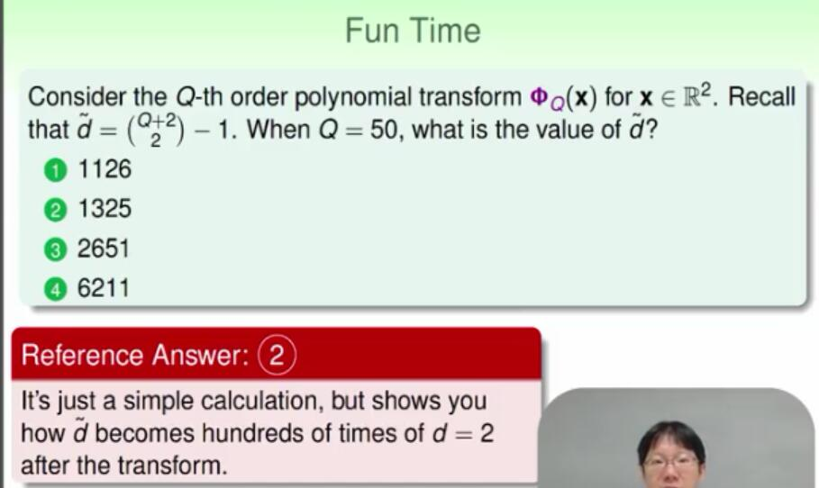

## Stuctured Hypothesis Sets

好，那我们这边来给大家看看我们刚才提到了这个多项式
的变换，我们在想跟大家多讲一些说这个多项式的变换到底是什么样子 好我们可以把这个多项式的变换，做一个比较
递回式的定义，它做的事情是这样，我们先定义`0维的变换`，也是变成常数 好就变成一个常数，还有`1维的变换`，也就是`常数加上所有这个，所有的一次式` 然后我们定义`2次的变换是这样，2次的变换 我们如果把之前的式子整理起来的话，我们会发现它前面的部分是1次的变换
后面的部分则是加上所有的二次式` 如果今天是3次的变换，前面是2次的变换，后面加上所有的三次式 一直到Q次的变换，它前面是Q减1次的变换，加上所有的Q次式 好这是我们之前提过的多项式的转换发生的事情 那也就是说什么，因为我们的每个变换都包含了前面的变换` 
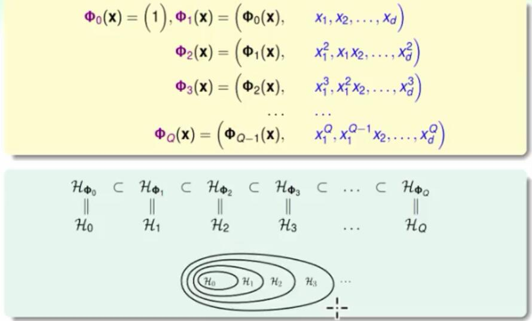
然后我如果在新的空间里面做线性的学习的话，我一定有那个自由度去把它什么 把我这个所谓的线的方程式里面，后面那些新增加出来维度的W的W~ 都设成0，所以我后面的变换等于是包含前面的变换，当做我的特例 或者我用hypothesis
set角度把它写下来的话，我的0号的hypothesis我用 这个φ0能够做到的事情，包含在我用φ1能够做到的事情里面 我φ1能够做到的事情，会包含在我用φ2能够做到的事情里面，好一路写下来 所以因为我的变换有这样的递回的关系，所以我的hypothesis set
也有这样的包含的关系 有这样包含的关系怎么样呢，我就把可以把它画成一个像这样的图，那为了
简化起见，不要让大家一直看那个φ所以呢我就直接把 HOφ0叫做H0，HOφ1叫做H1，好这样一路下去 好有了这张图，我们把它叫做一个structure也就是说当我的 hypothesis之间有这样互相包含的关系的时候，我们把它叫做hypothesis
set 的一个结构 有了这个结构怎么样，这个结构告诉我们什么样的事情呢，好我们有这样的 从属关系，有这样从属关系之后，如果我写下来说他们的VC dimension 到底长什么样子，好VCdimension代表什么，代表我可以shatter多少点 那既然H1里面的hypothesis比H0来的多啊，所以它
可以shatter的点一定比H0可以shatter的点来的多 对不对，包含原来的，然后又多出来，又多出来，你能够shatter的这个点的数量只会-
变多，不会变少 所以这边有一个小于等于的关系
对不对，我可以如果把这个小于等于写下来，因为我能够shatter的点 随着我的hypothesis的数量越变越多，应该我能够选择的点会越来越多 然后另外一方面是这样，如果我做的事情出来算VCdimension 之外，我还做我对每个hypothesis真的想办法去找到最好的Ein 也就是最低的那个Ein，我去找一个hypothesis
让它的Ein最低，对每一个hypothesis set我都做这一件事 那我就问啦，好那这些Ein，我们从 g0 g1 一直到g2 g3它的关系到底是什么
好今天hypothesis增加的时候，你的选择变多了 有可能在这些增加的选择里面，你找到一个有更好的Ein所以你的Ein就会下降 对不对，那如果你没有在增加的里面找到更好的Ein，那至少你的Ein会跟本来的一样 所以我如果看Ein的关系的话，应该是一路降下来的关系 不是一样就是降下来，好所以，它是一样有这串的这个关系，我们可以把它这样子写下来
好当有这样structure hypothesis set的时候我们可以写下
这样的东西或者画成图，就是我们很熟悉的这个样子 Ein随着VCdimension一路下降，随着我的hypothesis编号，hyp-
othesis set编号
的增加一路下降，然后呢，但是从complexity也就是VCdimension一- 路的上升 然后我们有兴趣的那个这个out-of-sample
Eout则是先下降后上升 也就是说这告诉我们什么，这告诉我，如果你一开始
就用很高维度的变换，例如说1126维度的变换的话 肯定不会做的好的，因为你已经在这个曲线的非常右边的地方，你的Ein可能很低 但是你的Eout会很高，因为你已经付出了很大的model complexity的代价
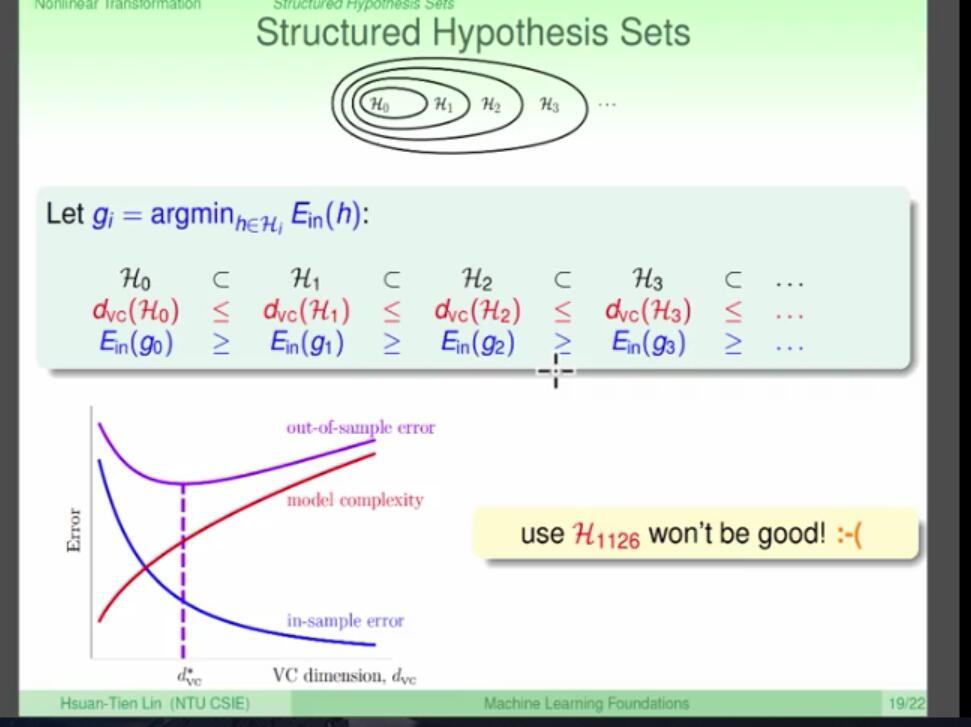
 好，也就是说什么 今天刚使用机器学习的人 刚接触feature transforme的人会非常想要使用像H1126这样的 东西，我们高维度的变换，高维度的变换，我很容易就得到Ein等于0，然后我去跟我
老板说老板老板，我得到Ein等于0了，老板如果一时不察的话 很容易被你骗，我说这叫tempting sin OK，非常具有诱惑力的犯罪 对不对，反正资料都在你那边，然后呢你做一个高维度的变换，做到Ein很小很小，然后跑-
去跟你老板说，老板我做的很好 但是我们在意的从来就不是Ein 好所以Ein只是我们一个中间的这个产物而已 那你今天如果做了一个高维度的变换的话 我们说这是path of no reture走上一条不归路啊， 无间道，走上一条不归路，说今天做了这个事情以后 好吧，做好了Ein 可是Eout很高，然后几乎没有办法做什么进一步的事情 安全的做法是这样，安全的做法是从第一维度 OK，第一复杂度的hypothesis set 开始做起，就是说你从曲线的左边开始 从曲线的左边开始，如果你试了linear 试了H1 然后你又做的很好的话，那怎么样，Ein就做的很小，好你就高高兴兴 的去说，老板老板我Ein做的很小，而且我用一个很安全的做法，所以你应该可以相信我
live happily
thereafter，OK未来就没有问题了，你Ein就已经做的很小，你不用再继续做- 什么事情了 如果Ein不够小呢，不够小你还是 有选择往曲线的右边去移动 你唯一浪费的是做这个H1的时候的计算，计算量而已
但是你还是可以很安全的往曲线的右边移动 那也就是说，我们希望交给大家的讯息是，你不要一开始就试那些很复杂的转换
从简单的hypothesis set开始做起，这样子 很简单很有效率吧，因为因为你的这个维度很小 很安全而且最重要的是，很多时候你都会意外的发现，其实它做的还不错 你千万不要因为线性就一定做不好，实际上很多时候线性是一个很好的 描述这个世界的这个必经的方式
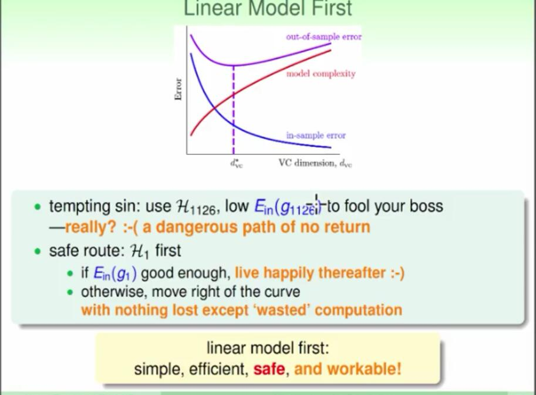
，好那我们这边讲到了说有不同的hypothesis，它有 不同的VCdimension，我们测试一下说大家到底记不记得我们讲的是什么样的事情
如果我们今天H1这个hypothesis set 在H1126这个hypothesis set里面的话
它们的VCdimension在下面的关系到底有哪一种是不可能发生的 好，那大家试了之后我们希望大家会得到正确的答案是 3，说我今天如果是大于的那种情形的话，这是不可能发生的 好，那我们今天呢把大家原来的linear model 延伸到non-linear 非线性的，我们可以说怎么做二次的事情 然后说额，然后其实我们可以做更多不同的事情，那这完整的non-linear
transforme 的流程到底是什么样子
但是我们说虽然这看起来很好用，但是实际上要付出代价，最重要的代价就是model complexity上面的代价是什么，那最后呢，我们告诉大家说，在你要付出这样代-
价状况下 你最安全的做法是，先试简单的model而不得先试那个最复杂的model 好那这边我们就讲完了说我们在线性跟非线性的 这个model上最基本的工具到底是哪一些 那我们讲到说这个变换，这个变换是Force，这个原力，大家如果看星际大战知道这个原力
那下一次我们要跟大家说的就是the Force，OK我们其实今天已经讲到一些，这个 the Force的dark
side黑暗面到底是什么，到底他造成对机器学习到底造成了什么不好的影响 然后我们之后再讲怎么样去控制这个黑暗面的部分 好，拿欢迎大家下一次回来，谢谢，感谢。 