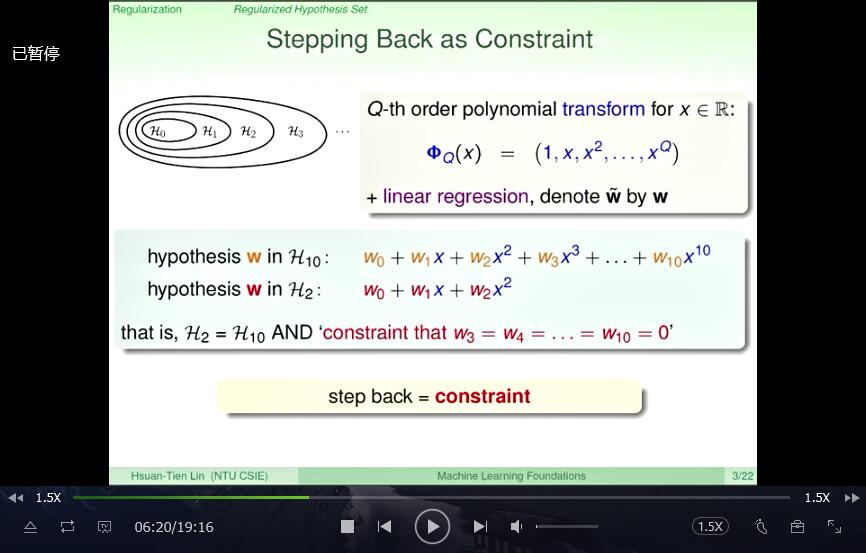

# Regularized Hypothesis Set

    那么先来看看我们上一次上了些什么，我们上一次说到说 在machine learning里面最大的危险之一就是overfitting Overfitting什么时候会发生呢，当我们有太多的power，然后呢我们的-

    资料里面 量又不够多，然后又有stochastic或者是deterministic

    noise的时候 那overfitting就很有可能会发生，那我们今天要讲的regularizati-

    on可以看成是对付overfitting的一个方法 那我们会先讲到说它的数学式子的推导是怎么样，然后把它延伸到各种不同的regular-

    ize的方法上面 好，那我们来看看，我们上一次讲到overfitting，我们画的这个图是典型的ov-

    erfitting的情形 我们的资料量没有很多，然后呢但是我们用了

    一个例如说四次多项式，更高次方多项式去fit它，然后 这时候我们把Ein做的很低，这条红色的线统统穿过我们的资料，但是

    Eout，也就是红色的线跟蓝色的线距离却非常的大 那我们今天要做的就是要从这样不好的状况变成 左边这样的状况，

    左边这个我们叫做regularized fit，这个规则化 规则化的fit，那我们等一下会说到规则到底是怎么样子，大家注意到在这个图里面的特点-

    是什么，这个图里面特点 是这个红线比起右边那边要平滑的多 那平滑以后也就比较贴近我们想要的 蓝色的这个目标函数。那我们这样是怎么做到的呢？大家如果还有印象的话，实际上我们在上-

    一次上课 就show过这两个图，`右边这个是一个四次多项式或者是高次多项式`

    做出来的，`左边是一个比较低次的多项式做出来的` 所以我们需要做的事情就是这样，我们需要做的事情就是从高次多项式的hypothesis

    set 好像走回去到低次多项式的hypothesis set，okay，也就是说大家如果还记得的话，我们说

    例如说我们如果今天是用多项式的时候，hypothesis set之间是有一个一层一层的关系 好，`低次方的会被包在高次方的里面` 

    那如果说我们今天用很大的hypothesis set，`高次方的hypothesis set会有问题的话`，我们是

    不是，稍微劝说自己`从这个很大的圈圈里面走回来走到一个比较小的圈圈里面` 这样子`就不会有overfitting的发生`，

    这是我们主要的idea 那这个regularize规则化这个名字呢是来自于早期在做所谓的 function approximation，也就是说我们要想办法逼近某个函数，

    像我们回归分析也是一- 个逼近某个函数的方式

    然后呢，approximation的时候大家发现说很多的问题是所谓的ill-pos- ed，ill-posed的意思

    实际上是有很多的函数都满足我们想要的solution，但是我们不知道要选择哪一个 于是呢我们就必须要限缩一下，不然的话解太多会造成

    一些问题。那我们今天做regression，同样某种角度也是一个解太多问题 我们就只有有限多个点，要穿过这些点的函数非常非常的多，

    那我们要从，怎么从里面` 限缩自己去选择出一个比较好的函数`，这是regularization要做的事情 

    好，所以我们现在问题是这样啊，怎么样从高次

    那我们这里用10次做例子，`怎么样从10次多项式走回到 两次的多项式去，怎么从高次方走到低次方去`

    好，要做到这件事情呢，我们就来看看我们还是用我们蛮熟悉的 这个多项式的转换还有linear 

    regression来做例子 那在这边呢，我们本来在我们本来的notation里面呢转换然后再做linear 

    regression 

    linear regression的这个weight，我们用这个w上面加上一个小蚯蚓来表示 用这个代表说我们在那个弯

    弯曲曲的z的那个空间里面，但是呢 在这堂课里面，为了简单起见，为了不要让大家看一堆的小蚯蚓在那边

    飞来飞去 所以我们一律用w来代，就是不加上小蚯蚓的w来代表 说我们在转换之后在那个z空间里面找到的这个weight
    好，那我们来看看，所以如果我们用这样表示 的话，我今天是十次多项式hypothesis长什么样子

    它就有`11个weight`，w0、w1、w2一路到 w10，好，有11个weight，它里面的每一个hypothesis，我的hypo-

    thesis set 里面的每一个hypothesis都长这个样子 那今天如果是二次多项式呢，大家想那很简单，

    二次多项式就是`只有三个系数而已` w0、w1、w2，好所以我列在这边，这对大家来说应该是`简单的式子` 

    那所以我们从这里看出什么事情来 我们看出来事情就是所有的二次多项式` 实际上就只是十次多项式加上一些限制`，

    什么限制？`在我们这里就是 三次的weight，四次的weight，五次的weight，一路到十次的weigh-`

    `t，w3、w4一路到w10统统 都要是0`，对不对，统统都是0就相当于用什么把它遮起来，所以我就只有一个二次多项式 

    这两个hypothesis的关系是什么，H2为什么包含在H10里面，因为H2就是H10 加上了我后面列红色的这个条件，

    这个条件是 w3、w4、一路到w10统统都要是0 好，所以什么叫从10号走回去2号，什么叫从十次多项式

    走回去二次多项式，实际上就是代表我想要在 我的learning问题上面加上所谓的constraint，加上一些条件，

    那我这边 的条件是一个很特殊的条件，3号、4号、5号一路到10号的weight统统都要是0

    也就是说什么，如果我们今天从 我们要解的问题，我们最佳化里面要解什么？我们要minimize Ein

    如果要找一个最好的十次多项式来`minimize Ein`，这个没有问题，大家现在已经很熟悉了

    `我的十次多项式就是有11个系数，然后呢我来minimize Ein想办法 找出最好的这11个w的组合`，

    来让我的Ein整个来说最小 那`如果我今天我要找出一个最好的二次多项式`，我要怎么做呢？我可以把我的

    hypothesis set想成说，`我跟那个十次的一样，我都考虑11维的w的向量`

    然后但是`我在hypothesis set里面加上那个条件说 后面那些维度我强制你一定要是0`，你不可以是其他数字 

    转化成最佳化的问题，转换成如果我要在这个 hypothesis set里面去minimize Ein的话，我会去做什么？

    我可以写下来事情是，我一样minimize Ein，但是我下面要加上一条

    `constraint`，这个constraint就是`w3、w4、w5，一路到w10 统统都要是0。`

    好，所以这跟左边是对照的，左边是我不加任何条件限制，反正

    我就是11维的向量，任何11维的向量，只要你能够把Ein minimize都是好的向量

    后面那个呢，右面那个呢，我们说我不是任何11维的向量都是好的 向量，如果你今天这11维的向量没有满足我的条件，

    我连看都不看，我连收都不收 我要在所有符合我的条件的向量里面，找一个最好的向量 

    好，也就是说我今天想要找一个好的二次多项式 相当于我是找一个好的十次多项式，

    但是加上条件 我要从十次走回二次这件事情就是我在解Ein的问题上面加上条件 

    你说老师啊，干嘛你弄得这么麻烦啊，为什么你不直接，既然你要解二次多项式 你就用三个系数就好，要解十次多项式，

    你就用11个系数，要解几次多项式，你就用多少个-系数就好 你干嘛要好像绕了一大圈说，把二次多项式

    表示成十次多项式，再说我要把你们统统设成0，`这样不是很麻烦吗？` 好，我们之所以跨出这一步的目的是`希望`

    `能够拓展我们的视野，让我们在推导后面的问题的时候 会变得容易一些`，什么意思呢？

    我们就来看，所以这是我们二次多项式，解 二次多项式的问题，我们说我们还是在一个11度的空间里面，

    但是加上了一些条件 `如果我现在把这个条件稍微放松一点怎么样` 我这边条件实际上说什么，我这边条件就是说今天把
    w3、w4、一直到w10这八个人一定要是0 特定的这八个，这八个w一定要是0哦 那如果我今天不要说特定的八个w一定要是0 我说`只要有八个w是0就好 所以你要3号到10号是0，没意见，1号到8号是0，没意见 1、3、5、7什么什么任何8个人是0`，没有意见，9个人是0，没意见，10个人是0，-

    没有意见 我把我的条件放松一点点好不好？ 也就是说，我今天不，`不追求说，`

    `我一定要特定的8个人是0，特定二次多项式。 我是任意的8个人是0，于是我可能是很多次的多项式。`

    不是很多次的多项式里面，因为只有少少的系数，所以你可以想成我的Hypothesis-

    ，看起来 会跟二次多项式有类似的简单。OK，因为，也有很多的项都是0，你只能用少数的项， 来组成你的多项式。

    那你的多项式看起来应该会比较简单一些。 变成[iii]问题要怎么样，所以一样，我们前面的部分都一样，

    Minmax Ein 现在只是条件写的方式不一样。我们的条件怎么样写，我们的条件写下来的方式是说， 

    哎，好，那我们接下来看，算一算，不等于0的人到底有多少个。 对不对，好，所以我这边有一个[iii]的Operation

    ，这个[iii]Operation 是说，不等于0的人到底有多少个。不等于0 的到底有多少个之后，我可以做什么？我可以说，哎，那，我我既然这个等于0的至少要8个，

    那不等于0的最多最多就是3个。 好，所以，我要用，OK，最多最多3个系数，来描述 我的Hypothesis Set，其他的系数，通通都是设成0，

    也就是说，有点像，我根本就不考虑它。好，这个Hypothesis Set，OK，今天我们叫做H2的Pron，

    只是为了跟我刚才那个H2二次多项式的，稍微做一点点连接。 我们如果把这个Hypothesis Set，跟我们刚才所知道的H2跟H10来作比较， 会发生什么事呢？

    好，我们看到，这个Hypothesis Set比H2要宽松一些。 为什么？好，因为任何一个满足H2条件的，他说3号到10号，他说那要是0。 也满足H2

    Pron条件，也就是说，任何一个左边的Hypothesis在右边，哎，是个满足条件- 的好学生。 

    但是呢，它又没有H10那麽包山包海，H10说所有任何 的系数都可以，现在没有，我们还是加上了条件，

    说你一定至少至少要有8个W是0。 好，所以这有点像是H2跟H10之间，冒出来的一个中间选项，OK，我们会比 H2更Flexible一点，

    然后但是，不会像H10那麽的Powerful，也就是说，也许不会那麽容易的Overfit。 好，所以呢，这个时候，好，我们就想，

    哎，那我们可不可以解这个Optimizatio- n问题？ 解出来一个好的W，然后这个W未来可以用，例如说，这个W会有什么特性？ 

    它因为有很多个是0，只有3个不是0，所以未来，拿这个W去做预测的时候。哎，很快， 因为我只要算，例如说，3项的值，然后加起来，我就输出去。我不用算10个值，再加起来-

    ，再输出去。 这种的W，我们叫做一个Sparse Hypothesis，OK，也就是说，它有很多0， OK，然后只有少数的不是0。那这样的Hypothesis，我们叫做Sparse。 

    好，所以这个Hypothesis Set看起来很诱人。不过呢，坏消息是这样， 大家看看我们右边的这个Optimization的问题，这个Optimization-

    的问题里面，我们 下的Constraint是说，最多最多有3个不是0。这Constraint里面-

    有什么？ 有一个这个，我们所熟悉的[iii]的Operation，这个是用来什么？算一算你到-

    底是0，还是不是0。 好，那大家现在跟Machine Learning，已经开始有点混熟了，

    有点经验了，你应该可以 感觉到，当我们看到这个[iii]Operation的时候，我们什么时候第一次看到？-

    在Perceptron那边第一次看到。 看到这个的时候，就会想到因为它是一个Discrete

    函数等等的，所以它的最佳化可能是困难的。 好，怎么样困难，我们可以跟大家说，这个问题，要怎么样找出 一个好的Sparse的W，

    也被证明是NP-hard问题。 好，所以这个问题，不是那麽容易见，OK，虽然说，哎，我们看起来不错，我们不是真正的-

    要做一个二次多项式，我们稍微放宽一点。 OK，然后看起来赚到一些好处，是说，例如说，我未来跟二次多项式

    一样，我只要算3项，我就可以输出答案，哎，看起来有点好处。 但是，我们不是很容易解这个问题。 那不容易解这个问题怎么办？

    我们能不能 来解一些我们可能比较会解的问题？ 好，所以左边是那个我们不太会，或至少不太会用有效的方法解决的问题。 

    我先列一个新的问题是这样，如果我今天做的事情是，好，`我还是Minmax Ein`， 不过呢，`我把我的条件换掉`。 我刚才左边的条件是什么？

    我左边的条件是，`算一算，有多少不是0的人， 有任何一个不是0的W，我就把它算成1，然后呢我说，这些数字加加起来， 要小于等于3。`

    我现在做一个类似的条件是这样， 我算一算，OK，对我的所有的W算一算。不过呢，为了要避开 这个，

    刚才这个Discrete的部分，我说我算一算的时候，我算W的 大小，我不要算说它到底是不是0。好，反正呢，是0的或很接近0的，就会很小，

    然后呢， 不是0的，就会很大。好，所以呢，我算一算，我算的时候，我是加W的平方。 也就是说，我这边看每一个W，然后我算它的平方，加加加加加起来，

    好，那我刚才说，我算-一算，最多， 要3个人不是0。我现在说，这个加加起来，我假设给它一个我心里的上限，这个上限是一个 哎，已经设定好的数字，

    好，我把它叫做C，好，例如说，我可能说，我的上限

    叫做13，或我的上限叫做15，或者我的上限叫11.7， 好，这样的上限。所以我可以想象这是一个类似

    的最佳化的问题。或者对应的Hypothesis Set会长什么样子， 会长这个样子。我说，我考虑所有的W。不过呢， 

    我希望`，这些W里面，所有的它的Wq的平方加起来， 都要小于等于C。也就是说，我的W的长度的平方要小于等于C。 `

    `我把这样的Hypothesis Set叫做H(C)，OK，代表这个C就代表说，哎，它跟 C有关，我设定一个C的数字，我就会跑出来说，`

    我的H(C)长什么样子。 好，那我们来看看。H(C)跟H2 Pron有什么关系呢？它们两个应该是有一些Overlap的。 `Overlap`的意思是，

    哎，如果我今天有一个满足H pron条件的， 它真的很Sparse ，它真的只有少数的W，这个， 不是0的话，哎，那麽它的平方加起来，应该也

    不太大。所以这个Hypothesis很有可能会包含在H(C)里面。 好，我今天是一个在H(C)里面也有一些Hypothesis是，哎，很少很少的 W，不是0，

    然后只有，有很多的W是0，所以这样的Hypothesis，

    也会包含在H2 Pron里面，所以，这两个Hypothesis Set是有Overlap的。 不过呢，大家当然可以想象，不是一定是这样，

    举例来说，我今天一个在H(C)里面的 Hypothesis可能它的每个W都很小很小很小，但是不是0，对，那这样的Hypo-

    thesis 就不会在H2 Pron里面。好，不过H(C)是有个好处的。跟我们刚才说 这个，H2，H3，H4，啊，这样一路到H10，有一个，

    这个重叠的这个关系。 那麽，这个H(C)之间呢，`也有重叠关系，而且呢，这个重叠关系是因为，C这个数字， 那C这个数字是个实数，所以我们等于是有无限多种的Hypothesis Set互相的重叠`，

    按照C的数字，从小排到大。OK，`那这个C很小的时候，Hypothesis Set很小`，就被包在最里面，C很大的时候， Hypothesis

    Set很大就在比较外面。如果我今天C是无限大呢， 就好像，我根本就没有条件一样，根本就没有条件，

    那就是我原来，最大最大那个Hypothesis Set，也就是H10的部分。 好，所以，我们把这样的Hypothesis，`H(C)这样的Hypothesis`

    `Set，叫做一个``Regularized Hypothesis`

    Set，OK，规则化，规则化实际上就是，加上条件的Hypothesis Set。 加上这个条件的Hypothesis

    Set，如果我们能够顺利的解决，右边的那个最佳化问题， 找出一个这个好的W话，我把这个W叫做W的REG。 就是在我们的规则，或在我们的条件下，找出来的Hypothesis。 好，那我们来看看，我们刚才定义了这个H(C)，那我这边想

    要问大家 说，如果我今天考虑的是H1的话，也就是我的C的条件是1。 那请问，下面的哪一个Hypothesis不会在这个Hypothesis Set里面。 好，那大家想一想之后，我希望大家得到，正确的答案 是3。那因为呢，你如果去把3这个向

    量的这个长度的平方算一算的话， 你会发现，这个向量长度的平方是Q+1，那这Q+1是比1来得大的。 所以，它不会在我们的Hypothesis Set里面。

# Weight Decay Regularization

    好，那我们来看看我们要怎么样解这个新的最佳化问题 我们现在是要做Regression，但是在上面加上了条件的限制 

    那在做解这个问题之前呢，我们先把这个问题表示成向量跟矩阵的形式

    是跟我们之前在Linear Regression做的一样，只是为了让我们符号上比较简单，比较方便

    好我们先看看objective function的部份我们要怎么样把它表示成向量跟矩阵

    的形式，大家回想一下我们在Linear Regression的时候已经做过一番推导了

    我们说这是一串的这个平方加起来，也就是它是某个向量长度的平方 哪个向量，Z乘上w，Z矩阵乘上w向量减掉y，这个向量的平方 

    所以我们这边就可以写下来说，这个其实就是Z w减掉y，好，这是里面的

    这个每一项，然后我们要它的平方，所以这个东西去transpose 然后它自己的本身 好，这个对大家来说应该是简单的，

    只是复习一下 那再来呢，我们加上了这个条件的部份呢，我们说我们

    希望一堆的平方加起来，然后要小于等于C，所以一堆的平方加起来什么意思 实际上就是w这个向量 的平方，所以呢是它自己跟它自己做内积的值 

    那这条式子实际上代表什么意思，在几何上来说它就代表我们要考虑的w 在一个球里面，它的球心是在圆点，然后这个球的半径是根号C，我们只考虑 

    球里面的w，这个球外面的w都不符合我们的条件，我们通通都不要，我们只要在这球里面的- w去选说 到底哪一个w的Ein，OK，我们上面要的那个Ein是最好的 

    好，所以我们要怎么解，我们现已经把这个式子完全表示成向量跟矩阵的形式了，那我们-

    要怎么解 好，那写下来以后呢，我们就来看看说，我们现在 `加上了这个条件`，`到底对我们最佳化问题造成了什么样的影响 `

    什么意思呢，我们想想看，我们之前在没有条件的状况下去解最佳化的时候，我们说怎么样 我们说我们就看我们的objective

    function，然后呢，`朝着那个谷底的方向`，一路滚下去 谷底的方向是哪里，我们说梯度的反方向告诉我们说谷底的方向在哪里 

    所以画在这个图里面的话就是怎么样，好，现在我如果

    `在一个点上，我现在说，我在一个点w上面的话 我要一路滚下去，滚到这个谷底下面的话，我说我会朝``负梯度的方向是一个我可以 `

    滚下去的方向，所以那是蓝色的方向，这个蓝色的方向告诉我我可以

    滚下去，最后滚到哪里，最后如果我一路很顺利的滚下去 我应该会滚到w lin，就是我做Linear

    Regression的那个solution 所以我现在在Ein，在某一个点的地方，也就是我的w在某个地方，然后，就是这个蓝色的 这个椭圆形，

    因为我们说椭圆形，为什么是椭圆形，因为我们说我们像一个山谷一样是个抛物-

    线，再往下 走的，我从这个椭圆形好像要一路滚到这个椭圆形这个中心那边去 从每个点滚下去，梯度的方向告诉我们怎么样从这个点滚下去 好

    `可是我们现在不是要滚到那个最低点啊` 滚到那个最低点就是我们原来解的Linear Regression没有条件限制的，我们现在要做什么

    `我们要做的事情是在条件下解这个最佳化问题 条件是什么，我们刚说的，条件就是我的w要在一个半径是 是根号C的球里面`，那这个球呢，

    我把它画成这个红色的 在这个球里面，然后呢它的球心是什么，它的球心是原点 好，这里是我的原点，我的解只能在这个球心里面 

    我很想要往那个w linear那边滚下去，但是我只有限制说只有在

    `在这个红色，在这个红色圈圈范围里面的才是我要的解，外面的通通都 不要`，所以`你可以想像大部份的时候，我们要的解都会在哪里`，

    都会在球的边边 好，现在就想，`假设我有一个w，已经在球的边边了 我怎么样判断它是，还是不是最佳解` 好，我们就来看看啊，如果我今天w已经在球的

    边边的话，我要判断它是不是最佳解，我们就要判断什么 它还能不能再从山坡上往下滚 在符合条件的状况下，它还能不能在山坡上往下滚 好，

    怎么样会不符合条件，滚出那个球去滚 出我们那个限制的球去就不符合条件，在一个点上，我怎么样滚出 我们的球呢，那就是球的 

    这个我们所谓的球的上面的切面的法向量的方向，我把它画成这个红色的向量 你在一个球皮上你如果往那个红色方向走，你就 滚出那个球去了，

    所以你要滚，绝对不可以往那个方向滚 你可以滚哪里，你可以滚垂直于 这个法向量的方向，也就是说滚横的这个方向是OK的，往外滚这是不行的 

    所以球的法向量告诉我们你不能往外走 好，球的法向量是什么，这边我的球的限制是w 的这个平方，长度的平方等于C，所以它的法向量 往外画，就是，

    其实就是w这个向量的本身 好，所以你不能往w那个方向走，因为这样，你已经在球皮上了，你会滚出 球去，但是你可以往哪里走，你可以往垂直这个向量方向走 

    所以现在问题是什么，如果我这边画了，如果你的 `这个梯度的反方向，有一个分量，这个分量呢，跟 法向量，跟我刚才那个红色的法向量是垂直的也就是我画成绿色的这边这一条的话 `

    那就会发生什么事，`绿色这边这一条告诉我 这是一个可以往下滚的方向，可以接近w linear的那个方向 然后呢，它又怎么样，因为它垂直于法向量，`

    `所以 它不会违反任何的条件`，也就是说我现在w这个点上

    `我如果往横的滚，我不要直的滚，我就还会安安稳稳的，至少我如果 走一小小小步的话，我还会安安稳稳的留在这个球里面 然后但是我又可以往这个w linear往比较低的谷底接近一点点 `

    好，所以如果我的梯度 `在垂直于法向量的方向有一个分量的话，那我就知道 我可以往下滚又不违反条件，表示我可以滚到一个 更好的解上面去，`

    那也就是说什么，如果我今天是在 最好的那个解上面，最好的那个解，大家记得我们刚才叫做w REG 我在最好的那个解上面的话，我就是什么，

    `我就是符合条件 又不能再往下滚，那就表示我的梯度的反方向 一定要跟我的法向量，那这边的法向量就是w REG的本身要是平行的 `

    如果不平行我就可以往下滚，所以平行的我才没有办法

    继续往下滚，在符合条件的状况下，我没有办法继续往下滚 好，那所以，`有了这个平行的概念，我们就知道我们要的解会满足什么样的性质 `

    那因为这样是平行的我们`干脆把这两个向量平行所以它们的比值设为 两倍的Lambda除于N`，这边有个2有个N，这些常数这是为了等一下的推导方便 

    那看到`这个Lambda有一些比较熟悉的同学会知道它叫做Lagrange`

    `Multiplier，这是用来解这种有条件` 最佳化问题很重要的一个数学工具，那我们刚才解释的实际上是这个Lagrange

    Multiplier的一个几何意义 如果没有学过的话，应该也可以从我们推的几何意义来

    看看说，这个条件，怎么样影响到我们的式子 `所以我们要求解的话，我们要做什么事，我们就要找出w REG`，然后看看 有没有一个相对应的Lambda，

    让两个向量是平行的，`这样才算最后找到 一个解`，这是我们要求解的方式`，我们要找到Lambda，我们要找到w REG 让这两个向量加起来，这个乘上Lambda，`

    `然后还有2除以N之后 加起来要是零，也就是说它们两个是平行`

    你说，老师你把这问题变困难了，`我本来只要求一个w而已 现在你又说我要求一个w，又要求一个Lambda，好像更复杂了 `

    好`，没有错，更复杂了，`那我们现在先想一想假设你有一个很神的同学 这个很神的同学跟你说，欸，我知道Lambda是多少 你说，

    哦`，知道Lambda是多少的话，事情是不是好像变得简单一点呢`，什么意思 假设它告诉你Lambda是多少，这里你就只要解一个

    你只剩一群变数是什么`，剩下一群变数是w REG 你只要解一个w REG的这个方程式就好了 而且它不但是一个方程式，你如果记得的话，这还是个线性方程式 什么意思呢，`

    `我们本来解的事情是什么，大家如果记得的话，我们这边有 Ein的这个梯度，Ein的梯度，我们上一次已经推导过了，好你回去Linear`

    `Linear regression`

    那边看我们怎么推导的话，你会记得说，诶，我的Ein的梯度会有一个 N分之2。好，这个2是因为原来有一些二次项掉下来的。 

    N分之2，然后里面有什么呢？里面有，好，Z这个矩阵， transpose Z乘上W，然后减掉Z， transpose y。好，你如果记得话，这就是我们的梯度，

    我们linear regression 里面做的事情 是什么？就是想办法求解这里面的这个东西是等于0， 对不对？所以，我们才会有那个说，诶，我要是把Z transpose

    y然后乘上Z transpose Z的反矩阵 这样的事情来求最佳的W。所以，我的Ein最后就变成这一个项目。 好，所以呢，我现在要解的事情变成什么，

    我现在要解的事情变成 我想要，诶，我刚才写下来这个东西，然后里面套WREG进去， 然后加上我刚才新加上这一项要等于0这个项量。 

    大家看看，这里面唯一的变数是什么？唯一的变数是

    `WREG在这里，WREG在这里，其它的通通是常数。 所以，这是什么？这是一个WREG的线性方程式。` 

    线性方程式会不会解？线性联立方程式，你说，我会呀，我们之前linear

    regression的时候实际上就是解了一个线性联立方程式。 怎么解？好，最佳的解就是：

    好，我把线性方程式里面 前面那些系数整理起来。有哪些？有Z transposeZ， 有这个 λ。好，然后这个

    λ部分等于是 λ 乘上一个单位矩阵。 好，所以呢，我这边有这个 λi。那一些不重要的常数通通被我 消掉什么？

    这个2，这个N，这个2，这个N，这都是我不需要的。 然后呢，那，诶，所以这前面是WREG 的系数啊，那后面是什么？ 

    后面有一个Z transpose y。这跟我们在linear

    regression里面是一样的。 所以，好，我解这个联立方程式，我就得到最佳解。 值得一提的是，只要 λ 是大于0的， 

    你可以很轻易地证明这个东西反矩阵是存在的，因为这个东西是 positive

    semidefinite，是半正定的。然后你又加上一个正的，所以它变成一个 正定的矩阵。正定的矩阵always是可逆的，

    所以这个解唯一是存在的。 如果有学过统计的同学会知道，这个东西在统计里面叫做 ridge

    regression。它可以看成是一个linear regression的一个进阶版，

    加上了一点点小东西。好，又或者我们可以怎样看这个问题呢？ 我们现在把它延伸来看说，如果我今天不一定是解这样的Ein。搞不好我是解logi-

    stic regression的Ein啊，对不对？ 那怎么样来看说我要解这个梯度，然后加上某一个项等于0这样的问题。 我可以把它对应到说，诶，

    我`之前在解梯度 等于0的问题的时候`，`对应到是我想要最小化` 我原来的那个函数。`那我现在要解梯度加上某个东西等于0`，那就` 相当于我要最小化原来的函数加上某一个东西`。 

    这个加上的东西就有点像，诶， 梯度是什么？梯度是原来函数的微分。 所以，诶，同样，我现在如果推回来的话就要把梯度拿来做积分。

    所以，我这边 有一个WREG，我如果拿它来做积分的话，我就会得到说我这边会有一项是 N分之 λ 的W， 好。于是，我加上了这一项。我相当于什么？

    我如果求 这一个最佳化问题的最小值的话就是要解上面那个方程式等于0。 对不对？好，大家相信自己说，诶，我如果把后面那项遮起来，我要解minimize

    Ein， 我就要求梯度等于0。现在，我要解minimize这个比较大的问题，我就要解上面那一串 等于0。好，所以呢，这个是相对应的式子，说我要

    解的新的问题是长这样子：有一个Ein，然后加上了一项。 `加上去这一项，我们通常把它叫做一个regularizer。` 好，也就是说，

    它的功能就是帮助我们做regularization。 然后，因为我现在原来Ein上面加上一项，所以呢，我会把这个东西叫做

    `augmented error。` 好，augmented就是加上去的，加上去的error。 好，所以，诶，这是我们新的式子，长这个样子，说，我们要借刚才那个问题，如果有人告诉

    我们 λ 的话，其实就相当于，诶，我们对着这个 λ ，然后解这个新的比较大一点点的问题。 我这一个大一点点的问题怎么样？这大一点点的问题里面没有constraint。也就是-

    说我们原来那个条件 跑到我要minimize的东西里面去当作一个regularizer。 好，所以这是我们的新观点。我们新观点说，我

    不一定要解那个有条件的那个问题。有条件的问题感觉比较难解。 我可能可以解什么？我可能解，可以解这个多带一项这个augmented，多带一项 的这个问题。

    啊，解完以后，我就得到我相对应的WREG。 我们能够解这个问题的条件是什么？我们要解这个问题的 条件是：有人告诉我 λ 是多少。 诶，

    有人告诉我 λ 是多少，我就可以解。那 λ 正常

    来说应该是正的，因为它代表了两个向量的这个比值。 那不过呢，如果 λ 是0，可不可以啊？ 想想， λ 是0代表什么？ λ 是0代表你就把上面

    这一项就划掉了，你在minimize，你不管那一项，那就表示你只minimize 前面那一项下，也就是minimize什么？Ein，也就是你把 λ 设成0就是你原来的linear regression的polynomial

    regression的问题。 好，你现在有 λ ，你就变成到有加上regularizer。 ok，有做这个规则化的这样的问题。好，所以我们建立了这两个 问题的这个连贯性。

    这两个问题的连贯性是什么？我今天本来想要解的是有条件的Ein。 然后，它相对应的问题是什么？它相对应的问题是：我只要想办法解一个，好，加上一项的 

    这个minimize问题就好了。好，所以，我现在，以前做的事情是什么？

    使用者告诉我说，诶，你要多少的C，你要加多少的regularization。 然后呢，我们就解解解地说，啊，有这个C对应的 λ，然后 怎样解。

    那既然C是一个，诶，设定好的这一个参数，我可不可以改跟使用者说，那你改给我 另外一个参数，好不好？你告诉我你要多少的 λ 。C有一个对应的 λ ，

    所以， 诶，`他给我C，不如给我 λ 。给我 λ 的话怎么样？哎，我太高兴了。 我就直接解那个没有条件的问题就好。我就不用再解 那个有条件，有个C啊，我还要找出`

    `λ` ，还要多花那个力气。 好，对使用者来说，`他告诉我C跟告诉我 λ ，力气可能差不多。那，但对我来说， 我若知道 λ 的话，事情容易多了`。我就顺着我上面那样推导，

    我就能够找到解在那里。 好，结果呢。好，我们来看一看不同的 λ 值到底发生了什么事情。 没有 λ 的时候，我们说没有 λ 的时候就跟你原来minimize Ein的时候一样。

    所以，发生的事情是什么？

    Overfitting。好，我们上次看到过了，对不对？就是，诶，我原来 那有一个很平滑的，结果你用一个四次多项式，就最后跑出来一个跳来跳去的。

    `好，加一点点的 λ ，一点点呢，0.0001的 λ` ，你就 发现结果很接近我们想要的：红线跟蓝线其实都很平滑、都很贴近。 好，你如果把 λ 越加越大，
    
    加到很大的时候怎么样？诶，你说， 诶，对啊，我有一条很平滑的线。不过，这
    
    条平滑的线看起来跟蓝线

    又差得远了。这个时候就是典型的什么？我们上次讲过，叫做 underfitting。也就是说，你的复杂度不够高，没有办法描述你的蓝色的线

    发生的情形。从以上的四个结果，我们看出什么？ 我们看出来说，唉呀，你只要加一点点的 λ ， 你就可以做到很多的事情。

    所以，我这边写这个谚语的句子。这谚语的句子是 a little goes a long

    way。本来是说，诶，一点点的努力，你就可以做很大的事情。 现在呢，你加一点点的什么就可以做很大的事情？加一点点的regularization。 

    加一点点的规则化，你就可以做出很大、很棒的 事情。好，那么呢，如果你把 λ 设得越

    大，这代表你希望的W 是越短越好，对不对？因为你 λ 有点像在惩罚你那些很长的W。你要minimize它，所以很长的W的时候， 

    诶，就会被惩罚。那也就代表了说，你实际上要的是，诶，比较小的C。所以，这就是 λ 跟C 之间的对应

    关系。然后也因为加上了 λ 之后，我们会希望比较短的W。 所以，通常这样的regularization有一个名字，叫做weight-decay

    regularization，也就是说 把那些weight变小的一种regularization

    方法。那我们这边跟大家讲的是，我们用linear regression、polynomial

    regression做例子。那实际上这样的regularization方式， 你可以拿来跟其它的来做搭配。例如说：可以跟logistic

    regression做搭配。 或者跟其它的transform，不一定polynomial，也许是其它你想用的tr-

    ansform 来做搭配。

    好，那，这边有一个小小的细节要跟大家 提一下。我刚刚说我刚才讲这个regularization可以跟任何的transfo-

    rm做搭配。 那我在这边为了给大家结果比较好看一些，

    在做transform的时候，我实际上做了一点点小小手脚。 我还是用polynomial transform，不过呢这个polynomial

    transform有一些些小小的缺点， 什么意思，我们本来知道polynomial

    transform是这样，就是说，一，然后一次式，二次式，三次式一直到Q次式， 你如果想，你今天的X你的输入的部份如果在负1到1之间的话， 你用这样的方式，Q次式假设是1126次式好了，

    X的1126次方，`会变成一个很小很小很小的数字， 这个很小的数字除了会有例如譬如说精确度的问题之外，最重要的是那边是很小 数字，代表这个数字要在你最后的hypothesis里面发生影响力`，

    `你就需要什么，你需要很大的w， 你需要很大的w，这就跟我们regulation想做的事情，就是你要把w`

    压倒很小很小好像有一些些这个不太好的地方。 也就是说看起来，我们`过度的惩罚了`

    `这些高维度，高维度真的需要很大的w`，但是我们说不行不行你不能用很大的w 好，那在我的这个刚才秀给大家的结果中，

    我用了一些比较 平衡的方式来表示我做了转换以后，Z里面的每一个座标。 说我用的技巧其实就叫做座标转换，

    我现在 原来说我这边有 有Q加1个座标，但是Q加1个座标，因为它们彼此不是垂直的，

    所以在不是垂直的时候，我做这个 regularization 的时候出了一些些问题，`这些问题导致 我在比较低次方的地方会比较好像容忍比较多，`

    `然后高次方的地方 做了太重的 regularization`，那我们怎么做呢，我想办法

    把`在多项式的这个空间里面，找出一堆垂直的基地`， 好，那今天如果对线性代数比较熟悉的同学会想象到说垂直的基地的意思实际上就是 

    例如说我`如果把这些函数当成向量，函数就有点像是这个无限多维的向量`， 我把它们当成向量的

    话，我希望这些函数的 这个例`如说彼此的内积`，要是0， 好，所以们用了一些特别的多项式，

    这些特别的多项式就有点像我是用原来的多项式 然后做什么，做那些垂直化的动作，好，大家如果有学线性代数，可能知道用高斯法作者这个-

    垂直化的动作 好，然后来算出来的各个不一样的这个基地，这些基地通常叫做这个Legendre

    polynomial 那这只是一个小小的细节，补充给大家知道，那如果你有兴趣搞懂的话，可以去查查Lege-

    ndre polynomial

    是什么意思，如果没有的话，你只是要记得说，也许你有机会碰到，你要做`polyno- mial regression`

    `要做regularization的时候，用Legendre` `polynomial给你的效果会比较好一些，那我们这边看到的，` 我列了前5个 Legendre

    polynomia给大家做参考，大家，你可以看到说这个也是个一次式，这个也是个二次- 式，这个也是个三次式

    只是它加上一些系数，加上一些相加相减的动作，让这些多项式彼此之间 是垂直的，而不像原来的多项式，会有一些问题存在， 

    好，那我们这边讲到了说，我怎么样做regularization这件事情， 那我们就问问大家拉，什么时候我们

    不做regularization得到的结果就是那个-

    WLIN， 跟我们做regularization得到的结果WREG会是一模一样的，这边有几个选-

    项，那大家可以看看， 好大家看看之后，我希望大家能够选到正确的答案是4， 1跟2对大家来说是简单的，1就代表说你就把那一项遮起来所以就不要了，2代表你根本没-

    有限制，所以就不要了， 那3是个比较值得注意的，就是如果你今天的C很大，也就是说你的条件很宽松， 宽松到什么，宽松到你那个红色的球很大，已经把WLIN包在里面了， 

    那么这个时候WLIN就是WREG的解，大部份的 时候，如果你的球小小的WLIN在外面，那就会是外面刚才

    外面刚才讲的那个情形，好，所以正确的答案是4。

# Regularization and VC theory

    好，那我们来看看，我们现在已经学了Regularization，大家可能会想啊，那

    它跟我们之前学过的VC Theory，这些理论上的解释，

    到底有什么关系呢？这是我们的出发点，我们要解一个Constrained的Ein问题， 这个Constrained的Ein的问题，我们说，因为是一个λ

    对应关系。所以我们偷懒，我们解了一个Augmented 的问题，也就是说，我今天，Unconstrained，但是我只要想办法把Augme-

    nted Error做到最小就好。 我们原始的问题对应到一个怎么样的VC Guarantee？对应到VC

    Guarantee就是说，我的Eout， 会比Ein，加上某个这个Complexity的Penalty来的小，这个Compl-

    exity的Penalty 有多少呢？里面重要项是H(C)，记得我们的H(C)吗？H 加上了C做条件，所以我们把H加上C做条件的状况下，

    算一算VC Dimension是多少，好，这样的话，这是我们相对应的VC的保证是这样子。 也就是说，

    我们做Augmented Error的时候发生了什么事？我们间接地 把右上角的那个VC

    Bound做好了，间接地。为什么，因为我们不是说设定一个λ，我们真的回去找说， 你的C是多少，等等等等，

    而是我们设定一个λ。然后呢，我们想象有个对应的C，然后在这-

    个对应的C下面， 我们会有这样的保证，但是呢，我们实际上并没有，把自己真的限制在H(C)里面， 对不对？

    什么意思，我在做最佳化的时候，有点像，因为我没有Constriained，-

    所以我还是考虑 了所有的W，只是我在所有的W上面加上一个有点像，我喜欢这个，不喜欢那个的这个Pen-

    alty。 但是我有没有考虑所有W，某种角度考虑了，只是考虑了以后，我只用了所有 W里面的一小部分，然后这一小部分，

    应该可以用来看看我的VC Guarantee是什么。 

    好，也就是说什么？我们可以回头来看看，Augmented Error 跟VC其实`有一些相似跟不一样的地方`。 什么地方呢？Augmented

    `Error在Ein上面加上了一下，是W Transpose W， VC在Ein上面加上了一项，这一项是所谓的Complexity的Penalty`，

    如果我们看Augmented Error的那一项， Augmented Error那一项说，哎，W

    Transpose W，某种角度我们可以把它看成这是一个Hypothesis， 到底有多复杂，你从多项式，你如果想象多项式的话，有点像这个Hypothesis到底-

    有多么，比如说，`弯弯曲曲`。 我们知道高次的多项式非常得弯弯曲曲，低次的多项式平滑一些，所以，这代表这一条线。 

    这一条W所代表的曲线的本身有多复杂。 那VC呢？VC这个Ω代表什么？是代表整个 Hypothesis

    set有多复杂，或者说有多少种选择了。 好`，所以今天VC跟Augmented Error，做事情好像 不太一样，可是又有点类似`，它们都在算某个东西的复杂性。 

    好，我们这边呢，稍微Overload一下我们的符号，我们干脆 `把那个W Transpose W我们的Regularizer叫做Ω of W好了，单一个W的复杂度。`

    我们`复杂度也用 Ω来代表，单一个W的复杂度，VC则是整个Hypothesis Set的复杂度`。 好，那如果我今天是这样，如果单一Hypothesis 的复杂度，跟 整个Hypothesis

    set的复杂度有一点关系，什么意思？我今天单一是一个很复杂的多项式。 那代表某种角度，它应该在一个很复杂的Hypothesis Set里面，

    好，`所以如果这两项有一点点关联性的话， 那么看起来，Eaug就会很接近什么？很接近VC的右边那边。` 那也许它对于我们想要做好Eout来说，

    是一个比较好的Proxy ， Proxy 什么？代理人，有一点像，`我们把Eaug做好，那它代理什么？代理把Eout 做好`，OK，那我本来做事情的时候，

    我本来是把Ein做好，Ein做好，当然也可以某-

    种角度把 Eout做好，`可是好像没有这个Eaug，Augmented Error 的结果来得好`。好，也就是说，这是另外一个看待Eaug的方法。 

    它做什么？它做的事情是，我们其实是有一点像运用一个， 这个代理人来帮我们做事，然后运用一个比原来的Ein更好一点的代理人。 

    好，这是Heuristic，这不是数学，我只是在对照Augmented

    Error跟VC Bound的差别。 然后用了这个代理人之后，我们就好像什么？我们自由自在啊，我们自由自在，可以所有的W-

    里面选一个，但是因为这个 `代理人比较知道哪个W跟Eout比较，好的Eout比较贴近一点，所以自由自在地，然后- 透过一个代理人，`

    然后来这个Heuristically得把事情做好。
 

    好，另外一个角度是这样。 我们看Augmented Error，我们说什么，我们要付出Complexity到底 是多少？
    
    我只看Minimization问题，我说我所有W都可以选，所有W可以选就代-

    表，所有的W 都是我的Hypothesis Set，那既然这样的话怎么样？代表理论上我最多最多要 要付出ᵭ加1的代价，Z空间我有多少个变数，那样的代价。

    但是我们之前就讲过了啊，我们实际上要付出多少呢？我们实际上考虑了多少，也就是说， 我好像全部都考虑了，但是其实只有少数人会在谷底的那附近。 
    
    `这少数在谷底附近的是哪些人？是在我的H(C)里面的人。 我给定了一个λ，我有相对应的C，在我的H(C)`

    里面的那些人，某种角度，好像才是真正会被考虑进去的人， 所以`我要付出的代价应该只有VC Dimension的H(C)那么多。 `

    `而不是VC Dimension H，OK，不是整个H，是只有H(C)的部分。` 也就是说，我们可以从这边概念上的，定义一个叫做Effective的VC

    Dimension， 什么意思？它考虑了我的Hypothesis Set，

    但是它也考虑我的Algorithm在这个Hypothesis Set里面 怎么做选择，在这里的例子里面，我怎么做选择，

    我只考虑那些 这个，W比较短的Hypothesis，我用

    Eaug的方式，好，所以我考虑了，我perfer，那些W比较短的， 好，把这些考虑进去以后，我实际上，有点像实务上 

    得到的等效的VC Dimension，OK，就会比原来 看似我要付出的VC

    Dimension要小一些，甚至是小很多。 所以我们在这边做的事情是什么？我们在Regularization做的事情是什么？

    我们还是，你如果认真去推导，你还是要付出很大的dVC， 不过呢，有效上来说，你要付出的dVC只有Effiective Effiective里的那么多，

    然后这个数字可能会小一些，因为这跟你的Algori-

    thm的性质有关。 也就是说，我们现在要衡量我们做事好不好的时候，我们就不是只看Hypothesis

    Set，我们是把Hypothesis Set 跟Algorithm包起来看，然后到底我们使用了多少个Power。 那如果你的Algorithm，

    在你的Algorithm里面踩刹车，像我们加上Reg-

    ularization 那个项就是踩刹车，那有可能你用到的VC Dimension，

    会比你整个Hypothesis Set要来的小，那于是你的Generalization可能会变得更好。 

    好，所以这边跟大家提到了Effective的VC Dimendion，那我们就问大家 概念上来说，如果我把λ增加的话，

    在做的这个Regularized的这个 Regression，那如果我把λ增加的话，请问effective VC

    Dimension会变大还是变小，还是它有什么样子的特性？ 那大家看一看之后，我希望大家能够选到正确的答案是2。

    因为我如果把λ增加， 就相当于我把C变小，C变小，就是Hypothesis

    Set变小了，那么VC Dimension就也变小了。

# General Regularizers

    好，所以我们来看看我们刚才讲到的 regularizer 我们都 集中在 weight-decay，就是那个 w 的平方，w

    tanspose，w 的那个上面， 那如果我今天想换更一般的 regularizer 呢，大家可能

    会问有没有什么 guideline 说我要怎么样 加上这些条件，你说 regularizer

    就是条件对不对，我到底要加上什么样的条件才是好的。 `最好的条件就是，我告诉你 target function 是什么，这是最好的条件。 `

    某种角度是啦，不过 target function 既然我们要做

    machine learning，我们这些是不知道的话，` 应该就算你有一个很神级的同学，他是不会告诉你说到底最好的 hypothesis 是哪一个，`

    不过呢，他最好告诉你什么？他最好告诉你说 好的

    `hypothesis 在哪一个方向。` 对吧，好的就是说符合你的 target 的

    hypothesis 在哪一个方向，对吧，它告诉我们 是一个比较小的范围来说你 prefer 那样东西。 所以一个好的 regularizer 会有什么特性，

    例如说它可能会跟 我们想要做，我们心里觉得从 domain knowledge

    上来说我们要做什么样的 target 有关。 既然说你今天如果想要的是一个比较接近偶函数的 函数的话，或者是说你想你

    的 target 可能是偶函数或者很接近偶函数， 你要加上 regularizer 可能会长什么样子，你会说，那我加上去的东西都只要 让那个奇次方的，

    奇数次方的这个 w 变小就好了，偶数次方

    的我不管它，偶数次方长大一点没有关系，奇数次方的我希望能够小一点。 这是如果你知道你的 target

    的一些特性，你也许可以把它放进去当做 regularizer。 然后呢，又或者什么，在实务上我们常常 会说我们选择一些可以说服我们自己的 regularizer， 

    例如说我希望我的 regularizer `可以让我很轻易地选 出比较平滑或者比较简单的 hypothesis。` 这是为什么，我们说 regularization 希望对付

    overfitting， overfitting 的造成是来自于 noise， noise 不管是

    `Stochastic 还是 deterministic noise ``记得那个跳来跳去的吗`？跳来跳去就代表不平滑， 好，所以如果我们要说我们的 target 相对于 

    noise 来说应该是平滑 的，那我们就应该要多多选出那些平滑的人，然后那些跳来跳去的你最好最好不要选。 所以例如说什么？

    我们在`下一页会跟大家介绍一个不一样的 regularizer 叫 L1`，OK，它 在实务上还算蛮有用的，我们一般叫做

    `sparsity regularizer`，为什么叫做 sparsity，我们等一下再讲，大体上来说，它做事情非常简单，它说

    `我加上去的不是那个 W 的平方，而是 W 的一次方，加起来，一次方，取绝对值的一次方加起来`， 好，这个 regularizer 待会我们详细跟大家介绍，

    `它会帮助我们找出简单的函数在哪里。` 好，又或者什么呢，又或者我们还是可以找 我的 regularizer 最终是要加进去我的 optimization

    里面啊， 所以我也希望找什么，希望找说好 `optimize 的 regularizer`，例如说我们刚才讲的

    `weight decay`， 就是这样的 regularizer，对不对`。我加进去我只是加一个平方项，看起来 我整个 optimization 问题跟原来的没有太大的差别。 `

    好，那你说说了这么多，表示我还是不会选 啊，我如果今天找到一个不好的

    regularizer 怎么办呢？ 不要急，regularizer

    前面乘了什么？` λ，你说找到一个不好的，只要你把 λ 等于零也放到你的选项里面，最差最差也就是不用它而已啦`， 但是 OK，

    你会不会一定受到那个不好的 regularizer 不好的例如说把你你想要的 target 越来越推开的那个

    如果是不好的怎么办，没有关系，你还有一个 λ 等于零的最后的这个保护。 

    好，所以 regularizer常用的 选择的方式一个是看你有没有觉得 target 应该长什么 样子。然后呢再来可能是能够说服你自己说他有好 处的或者是今天容易 opitmize 的， 

    有没有觉得这三个 criteria 好像在哪里听过。 我们今天一直在逼大家说回忆一下我们之前教过些什么东西。 

    有，我们之前在第八讲，讲 error measure 的时候讲 说 error measure 有三个可能性，user

    告诉我们它真的想要什么， user 讲不出来，我们选一个能说服我们自己的，然后另外有可能我们会选一个好 optimize 的 

    这样的话我们就可以比较容易把 minimize Ein 一类的问题 做好，所以我们今天实际上是把这两个事情混起来，在 augmented error 里面我又 有这个 error

    这三个选项，然后又有 regularizer 也是三个类似的选项。 大家可以看到说这是 machine learning 在设计演算法的时候很重要的 三个不同的面向，不管是在 error function

    还是在 regularizer 都是类似的选择。 好，那我们来看看，我们刚才讲过这个 L2的 regularizer，

    大家应该还记得 它的最佳化问题是长这个样子，那这个 L2

    regularizer 你看它就是W的平方而已，所以对 W 来说它非常的 平滑，它实际上是凸凸的，它非常的平滑，然后可以微分等等

    等等，所以对我们来说做最佳化的问题， 比较容易一些。然后呢，那但是，OK，如果今天是一个 L1 呢， 好，L1 的话，我们会看到说，它解的事情是

    我加进 regularizer 是把所有的 w 的绝对值加起来， 也就是说重新定义的话，这就是所谓 w 的 one norm。 OK，

    就是这个用 one norm 的方式来算这个长度。 好，那么它是 convex 的，OK，一样因为

    这是绝对值函数，绝对值函数是这样尖尖的，但是还是凸起来的。 然后不过，因为它是尖尖的，所以它有那个点是两边尖尖的这个交合 

    的地方也就是 W 等于零的那个地方，会让它是不可以微分的。 所以最佳化来说，它稍微难解一些，还是 convex

    所以有好解的地方，但是呢因为有那些尖尖的点，所以难解一些。 那我们用上面这个示意图来告诉大家说这个 L1 的解 常常会是 sparse 的，

    大家记得我们刚刚讲 sparse

    是什么，sparse 就是我的 W 里面有很多个 0，只有少数个是 1。 为什么，我今天的 W 如果，好，例如说我们想象说我 W 都没有0 的话， 都没有 0

    也就是说我会在这个方块，这个方块代表我的 one norm 是等于 C。 可是在我的那个条件的最外面，所以我现在不是一个圆球，我现在是一个这个菱形的球，-

    我可以在 多维空间上，我的条件告诉我说我必须我要找的 W 在这个菱形的球里面， 我如果在这个菱形的球的边界上，而不是在顶点上的时候，

    好，大家记不记得，我们说我们要看是不是最佳解， 我们就要看什么，就要看梯度和梯度的反方向。 跟垂直于我这个平面的方向到底有没有平行。 

    垂直于我这个平面的方向是什么？垂直于我这个平面

    我这边画，垂直于我这个平面的方向实际上也就是 我取 W 的正负号的方向，所以这个方向就是什么，

    好，我今天 W 是正一，那这个方向是正正正正正，都是正一 的。如果我的 W 是负一，就是负一然后正一正一正一，所以我如果取这个方向，方向等于是把我这个

    regularizer 做一次微分， 大家应该很容易可以得到这样的结果，然后我的 Ein 我的那个一堆实数的 那个 Ein

    要跟这个正一正一正一这个都是正整数的这个方向要是平行的， 这件事情看起来，你从那个图可以看出来，可能在边边上不是很容易。 

    在边边上，你就说你的 Ein 常常跟你的垂直的这个方向不是平行的。 不是平行的会怎么样，就会一直有那个绿色的分量拉拉拉拉拉， 

    拉到哪里去，拉倒顶点上面去，才会得到最佳解。 好，所以在 L1 的 regularization 在我加上这个 L1 上去 的时候，

    它的最佳化问题最后的解常常会发生在 顶点上，发生在顶点上什么意思，顶点就是有一些 W 要是 0。

    好，所以它会得到所谓的 sparse 的 solution。 那这个呢 sparse solution

    什么时候有用，我们刚刚已经暗示过大家， `sparse solution 你今天要做最后的预测的时候，你就只要算不是零的那几项就好了。 `

    所以会比较快，举例来说，你今天用你的手机好了，好，用手机要做某个资料分类的问题， 你说，我训练好了一个一千一百二十六个维度的

    

    W，然后呢我每一个维度算算算算算，算完以后你的手机的电也耗完了。 但是你说我一千一百二十六个维度的 W 里面其实我只需要5 个，好，所以你手机就算 5 个，

    咚 结果输出出去会比较有效率，会比较不耗电，好，这些都是一些可能的应用。 好，那我们再来看看，好我们刚才讲到说，有 regularizer 

    以后，然后再来选择上还有另外一个选择是 λ 要选多少。 我们这边 show 给大家三个不同的 Stochastic

    noise 的情形，这三个情形是 Stochastic noise 是 0， 是 0.25 是 0.5 的时候，然后呢， 我们对 λ 做 不同的变化来看看说 Eout 到底是多少。 

    好，我们想一下我们作弊，我们把这一条曲线做出来以后，然后选一个什么，选一个 Eout 最低的点，好，像在这里，Eout 最低的点是在这里，

    代表我们应该要选这个 λ。 这里 Eout 最低的点是这里，代表我们应该要选这个 λ，这里 Eout

    最低的点是这里 好，这是 Stochastic noise 的情形。 我们还 show 给大家 deterministic noise

    的情形，这是没有 deterministic noise 也就是我是一个十五次多项式，我这边刚好都是用十五次多项式，十五次多项式就是没有

    deterministic noise 的情形， 三十次，有

    deterministic noise，一百次有很大的 deterministic noise 的情形，好，看看最好的 λ 是多少。 

    `从这两个图大家不难发现，最好的 λ， OK，取决于你有多少的 noise，noise 越高，λ 最后越大。好，这不意外，也就是像说`

    `你在开车的时候，路况越不好，你刹车要踩得越多，我们说 regularization 就像是踩刹车一样，路况越不好你刹车要踩得越多。 `

    不过你会说，老师我又不知道 noise

    是多少，对，不知道 noise 是多少，`所以很有可能 你会在很多个不同的 λ 里面你要做选择，找出一个最好的 λ。 `

    `这才能让你的 regularization 发挥真正的效用`。 好，那就问了，那我要怎么做选择呢？好， 时间到了，我们卖个关子，下一次的上课我们就会告诉大家说

    你要怎么做选择，不但是怎么选择 λ，我们还会告诉你说怎么样顺便选择 φ， 怎么样顺便选择不同的 linear model，你要用哪一个，

    好，所以在我们已经学过 的各式各样选择里面，请你下一次回来跟我们学习如何做选择。 

    好，最后呢再给大家一个练习说如果我今天使用了这样的 regularizer 说我在 Wq 的平方的前面乘上2 的 q 次方，

    请问 这样的 regularizer 会喜欢下面哪一种的 这个 hypothesis，好那大家看一看后，我希望大家选到正确的答案是 2。

    也就是说我们在高维度的地方加上了很重的 regularization，那个

    2 的 q 次方，很大的数字，所以我希望 W 越小越好。 所以我今天会比较喜欢低维度的多项式。 

    好，那我们今天跟大家讲过了 regularization，我们讲到说 我们 regularized hypothesis

    set 其实就是在原来的 hypothesis set 上面加上条件， 加上了这个条件之后呢，那我们可以把要解的问题最后转

    换成一个 augmented error 的问题，也就是把 W 的平方加进去。 那这代表了我们会降低 effective 的 VC dimension
    
    ， 然后最后呢，我们说到说 regularization

    是一个非常 general 的工具。 而这非常 general 的工具，我们可以设计跟

    target 有关，或者是能够说服我们自己。 或是好 opitmize 的 regularizer

    来加进去我们的 formulation 里面。 

