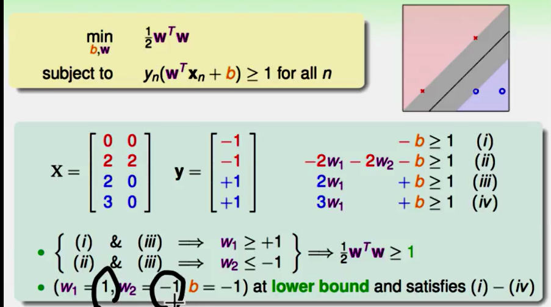

# 线性支持向量机

哪一个线最好呢？

从以往来看：

$E_{out} \le E_{in} + \Omega(d_{vc})$

这三条线好像都差不多

但是就看灰色圈圈，可以看到，灰色圈圈的半径越大，可以容忍的噪声也就越大，他也就越稳健

那么如何确定这个灰色圈圈的半径呢？

可以看离他最近的点的距离到底是多少？

$b和w$分开

## 计算点到平面的距离

$w^T$是平面的法向量

距离就是$x-x^{'}$在平面上的投影

那么就是

subject(条件就是)分类正确的线：
分类正确意味着$y_n(w^Tx+b)>0$恒成立

所以就可以把distance替换为：

$w^Tx+b=0与3w^Tx+3b=0$是等效的

所以我们就可以进行一个放缩:
$令min_{n=1,2,...} y_n(w^Tx_n+b)=1$
所以$margin(b,w) = \frac{1}{\Vert w \Vert}$

对条件进行放大

反证法：假设(b,w)落在外面即所有的都大于1，那么可以利用之前的方法对b,w进行放缩，那么margin又更大了，那它就不是最优解，所以假设不成立。所欲就都大于等于1

会发现，不再边界上的点去除了，对于这个线的选取，一点影响都没有

一个通用的解：

以上是一个二次规划问题：

就可以表现为一个二次规划的`形式`

二次规划的标准形式是：

u向量的二次项系数是Q，p是u一次项系数，然后是条件：$a_m^T \ge c_m$

对应之前的式子

objective function and subject:

