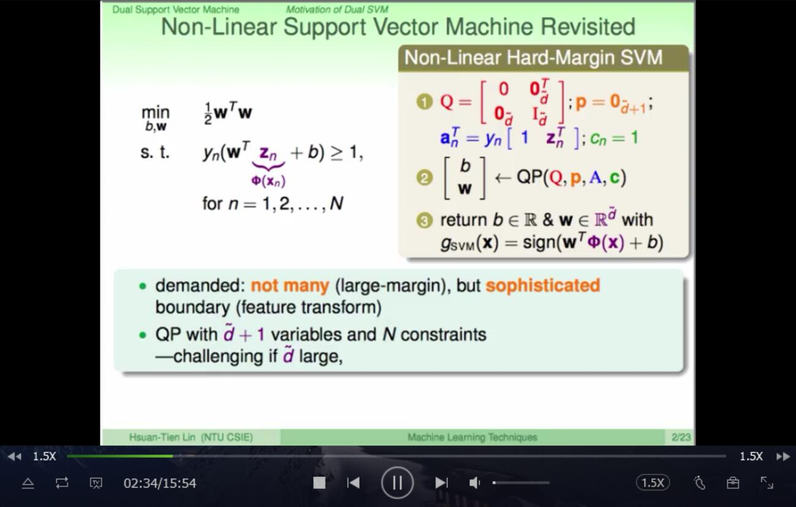
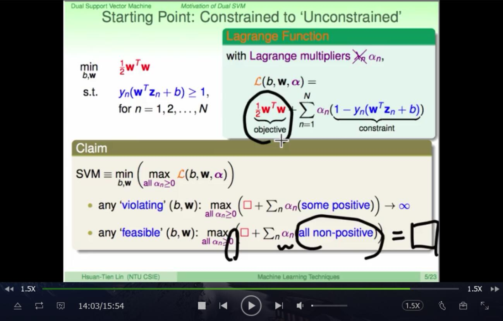
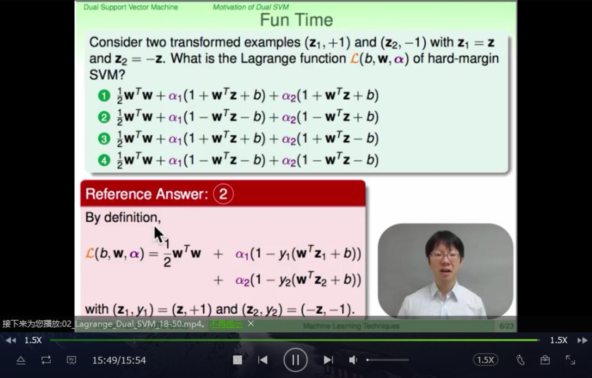
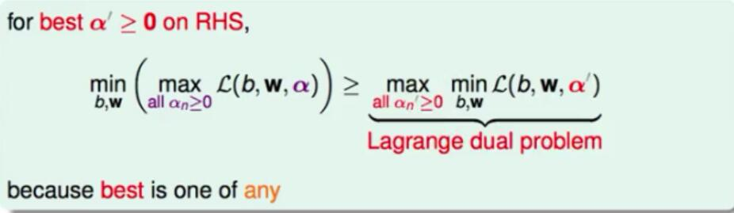
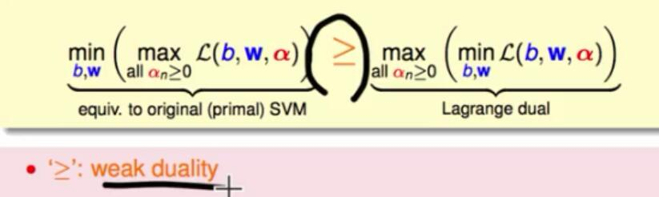
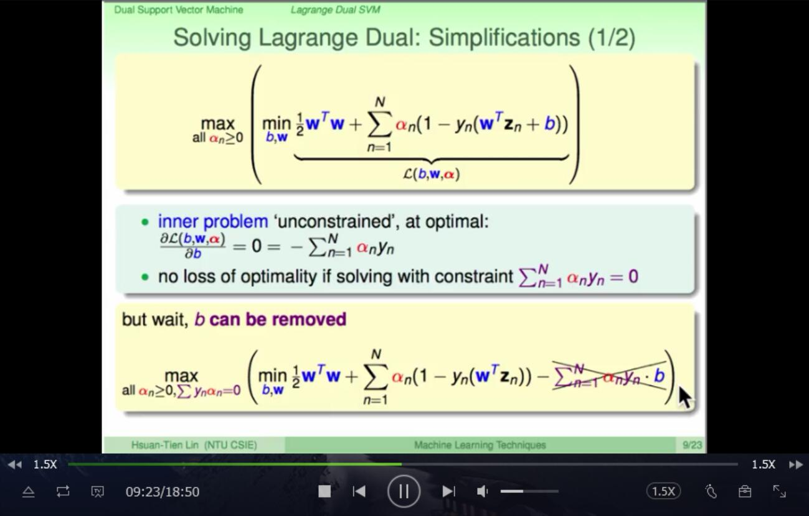

# 对偶支持向量机

二次规划问题有$\overline{d}$+1个变量和n个限制

如果$\overline{d}$很大，将会变得很复杂

将与$\overline{d}$有关的转换为与N有关的，涉及复杂的数学计算，不用去完全推导

推导过程如下：
s.t.:
$y_n(w^Tz_n+b) \ge 1$

$=1-y_n(w^Tz_n+b) \le 0$

所以就可以将上节课讲的内容的求解变为：

$L(b,w,\alpha) = \frac{1}{2}w^Tw + \sum_1^N \alpha_n(1-y_n(w^Tz_n+b))$

上节课说到s.t.的边界是一定可以取到的，所以就可以将左面变为：

$\mathop{min}\limits_{b,w} (\mathop{max}\limits_{all \alpha_n\ge0}L(b,w,\alpha))$且此时让所有的$\alpha_n \ge 0$

---

选一个特定的$\alpha^{'}\ge 0$，$\alpha$是满足条件即使式子最大的那个，那么一定有如上图

$\alpha^{'}$是选的特定的，假设选了可以选的$\alpha^{'}$最大的那个，也一定比$\mathop{min}\limits_{b,w} (\mathop{max}\limits_{all \alpha_n\ge0}L(b,w,\alpha))$小

所以有如下图：

如果它是凸函数，有解的（向量空间内是可分的），有线性约束，那么等号就是严格成立的

先看min内的内容，那么首先想的方法那就是求梯度并令其为0，其推导过程及结果如上

就把b给消掉了

再对$w$求导:

现在b和w已经几乎消失了

kkt:

第四点需要说一点,前面说到了$\alpha_n(1-y_n(w^Tz_n+b))$满足第一条是0，不满足应该是无穷大，但第一点又限制了第一点是成立的，那么就有它严格等于0了

### fun time

---

再进行一些标准化后得到的是蓝绿色的样子

