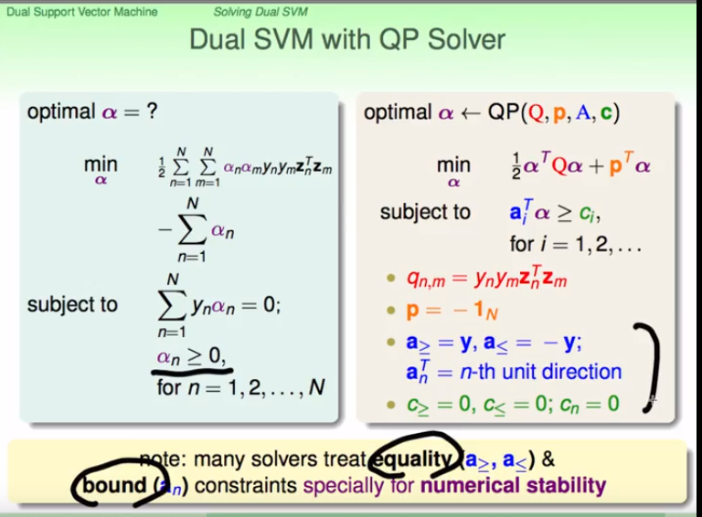

# 对偶支持向量机

二次规划问题有$\overline{d}$+1个变量和n个限制

如果$\overline{d}$很大，将会变得很复杂

将与$\overline{d}$有关的转换为与N有关的，涉及复杂的数学计算，不用去完全推导

推导过程如下：
s.t.:
$y_n(w^Tz_n+b) \ge 1$

$=1-y_n(w^Tz_n+b) \le 0$

所以就可以将上节课讲的内容的求解变为：

$L(b,w,\alpha) = \frac{1}{2}w^Tw + \sum_1^N \alpha_n(1-y_n(w^Tz_n+b))$

上节课说到s.t.的边界是一定可以取到的，所以就可以将左面变为：

$\mathop{min}\limits_{b,w} (\mathop{max}\limits_{all \alpha_n\ge0}L(b,w,\alpha))$且此时让所有的$\alpha_n \ge 0$

---

## 解-对偶支持向量机

选一个特定的$\alpha^{'}\ge 0$，$\alpha$是满足条件即使式子最大的那个，那么一定有如上图

$\alpha^{'}$是选的特定的，假设选了可以选的$\alpha^{'}$最大的那个，也一定比$\mathop{min}\limits_{b,w} (\mathop{max}\limits_{all \alpha_n\ge0}L(b,w,\alpha))$小

所以有如下图：

如果它是凸函数，有解的（向量空间内是可分的），有线性约束，那么等号就是严格成立的

先看min内的内容，那么首先想的方法那就是求梯度并令其为0，其推导过程及结果如上

就把b给消掉了

再对$w$求导:

现在b和w已经几乎消失了

kkt:

第四点需要说一点,前面说到了$\alpha_n(1-y_n(w^Tz_n+b))$满足第一条是0，不满足应该是无穷大，但第一点又限制了第一点是成立的，那么就有它严格等于0了

### fun time

---

再进行一些标准化后得到的是蓝绿色的样子

以上需要说明一下的是：

对于s.t.:

由于标准的QP问题是大于等于的，而这里是等于的。

等于其实是可以划分为同时满足大于等于和小于等于的。

然后分开讨论会发现，所对应的结果也是大于等于C(C=0)，和小于等于C(c=0)，最后的结果就是等于0了，而大于等于和小于等于其实可以通过取符号等价的，所以等于也是可以是一个二次规划问题的 

上图说明一下，最后一个条件$\alpha_n(1-y_n(w^Tz_n+b)) = 0$ 意味着：$\alpha_n > 0$那么就有后面的等于0，如果后面的大于0，那么$\alpha_n = 0$就必然成立

还需要说的就是,$y_n = \pm 1$,把以上的complementary slackness式子括号中同乘以$y_n$，那么就能得到b的结果了。

再说最下面的黄框，$\alpha_n > 0$ 就意味着括号内等于0，那么就意味着在胖边界上，也就意味着这个点是一个支持向量。

### funtime

---

## 对偶支持向量机背后的知识

第一小节把线性支持向量机由跟$\overline{d}$相关联的复杂度变为了仅仅和$n$有关，通过引入$\alpha$，思路仿照regulazation。

而后又推出了complementary slackness，$\alpha$的正负号决定了其是否是支持向量（$\alpha_n > 0$其是支持向量）

将$\alpha$与支持向量联系在一起了

**sv有什么重要性**

以上意味着，$W_{PLA}$可以由犯错的点表示出来
$W_{SVM}$可以由那些位于胖边界上的点表示出来

**Amazing!!!**

此处说一下，$Q_D$还是和$z$有关的，而$z$还是和$\overline{d}$有关的

如何避开这个计算呢？

下一讲解决这个问题。

### fun time

